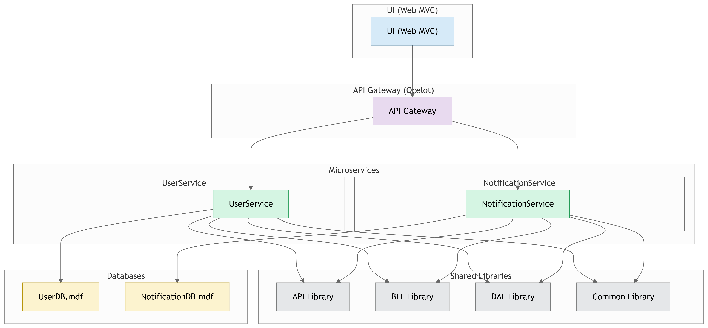

# NotificationSystem 

## Diagram 

## Project Structure: 
* Common 
  * Common Library .NET Stadard 2.0 
  * DAL Library .NET Stadard 2.0 (Microsoft SQL Server (Local mdf), Dapper)
  * BLL Library .NET Stadard 2.0 
  * API Library .NET Stadard 2.0 (Swagger)

* Services 
  * UserService ASP.NET Core 3.1 Web Api RESTFul 
  * NotificationService ASP.NET Core 3.1 Web Api RESTFul 

* ApiGatway (Ocelot)

* UI 
  * UI ASP.NET Core 3.1 Web MVC (RestSharp)

## Database: Microsoft SQL Server (Local mdf) 
* DB1: Tables: Users  
* DB2: Tables: Notifications, NotificationHistories, SPs: SP_NotificationHistory_I, Types: Type_NotificationHistory 

## Web Services: C# ASP.NET Core 3.1 N-Tier  
* Two Micro-Services: UserService, NotificationService 
* ApiGatway 

## UI: C# ASP.NET Core 3.1 Web MVC / HTML5, CSS3, JS, jQuery, Bootstrap 
* Pages: Notifications List, Notification Add 
* Note: Using all services by ajax 

## License

Licensed under the [MIT license](LICENSE.md).
