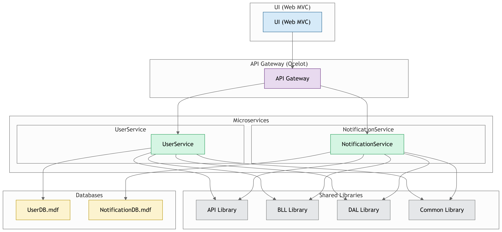

# NotificationSystem 📢

[](https://deepwiki.com/ahmadmdabit/NotificationSystem)
[](https://dotnet.microsoft.com/)
[](LICENSE.md)

## 📋 Table of Contents
- [Overview](#overview)
- [Key Features](#key-features)
- [Architecture Diagram](#architecture-diagram)
- [Tech Stack](#tech-stack)
- [Getting Started](#getting-started)
  - [Prerequisites](#prerequisites)
  - [Installation](#installation)
  - [Running the Application](#running-the-application)
  - [Service Ports](#service-ports)
- [Project Structure](#project-structure)
- [API Documentation](#api-documentation)
- [Development](#development)
  - [Architecture Details](#architecture-details)
  - [Adding New Features](#adding-new-features)
- [License](#license)

## 📖 Overview

A modern, scalable notification system built with .NET Core using a microservices architecture. This project demonstrates best practices in software design, including separation of concerns, clean architecture, and API gateway pattern implementation.

The application consists of multiple components:
- **Microservices**: UserService and NotificationService for handling business logic
- **API Gateway**: Centralized routing using Ocelot
- **Web UI**: MVC application with responsive design
- **Shared Libraries**: Common, DAL, BLL, and API layers for code reuse

## ✨ Key Features

- 📧 **Notification Management**: Create, send, and track notifications
- 👤 **User Management**: User registration and profile management
- 🔌 **Microservices Architecture**: Independent, scalable services
- 🚪 **API Gateway**: Centralized request routing and management
- 📚 **API Documentation**: Interactive Swagger UI for all services
- 🎨 **Responsive UI**: Modern web interface using Bootstrap and jQuery
- 🗄️ **Local Database**: SQL Server LocalDB with Dapper ORM
- 🔒 **CORS Support**: Cross-origin resource sharing enabled

## 🏗️ Architecture Diagram

[](https://gitdiagram.com/ahmadmdabit/NotificationSystem)



## 🧰 Tech Stack

| Layer | Technology |
|-------|------------|
| **Framework** | ASP.NET Core 3.1 |
| **Architecture** | Microservices with API Gateway |
| **Languages** | C# |
| **Database** | SQL Server LocalDB (Dapper ORM) |
| **API Gateway** | Ocelot |
| **Frontend** | ASP.NET Core MVC (Bootstrap, jQuery) |
| **API Documentation** | Swagger/OpenAPI |
| **HTTP Client** | RestSharp |

## 🚀 Getting Started

### Prerequisites

- [.NET Core 3.1 SDK](https://dotnet.microsoft.com/download/dotnet-core/3.1)
- Visual Studio or Visual Studio Code
- SQL Server LocalDB (included with Visual Studio)

### Installation

1. Clone the repository:
   ```bash
   git clone https://github.com/ahmadmdabit/NotificationSystem.git
   cd NotificationSystem
   ```

2. Build the solution:
   ```bash
   dotnet build
   ```

### Running the Application

1. Start the microservices:
   ```bash
   # In separate terminals
   cd UserService && dotnet run
   cd NotificationService && dotnet run
   cd ApiGateway && dotnet run
   cd UI && dotnet run
   ```

2. Or use the watch command for development:
   ```bash
   # In separate terminals
   cd UserService && dotnet watch run
   cd NotificationService && dotnet watch run
   cd ApiGateway && dotnet watch run
   cd UI && dotnet watch run
   ```

### Service Ports

| Service | URL |
|---------|-----|
| UserService | `https://localhost:44344` |
| NotificationService | `https://localhost:44314` |
| ApiGateway | `https://localhost:44315` |
| UI | `https://localhost:[port]` |

## 📁 Project Structure

```
├── Common/
│   ├── Common Library (.NET Standard 2.0)
│   ├── DAL Library (.NET Standard 2.0) - Dapper & SQL Server
│   ├── BLL Library (.NET Standard 2.0)
│   └── API Library (.NET Standard 2.0) - Swagger
├── Services/
│   ├── UserService (ASP.NET Core 3.1 RESTful API)
│   └── NotificationService (ASP.NET Core 3.1 RESTful API)
├── ApiGateway/ (Ocelot API Gateway)
└── UI/ (ASP.NET Core 3.1 MVC - Bootstrap/jQuery)
```

## 📚 API Documentation

Each microservice includes interactive Swagger documentation:

- **UserService**: `https://localhost:44344/swagger`
- **NotificationService**: `https://localhost:44314/swagger`

The documentation provides:
- Complete endpoint list
- Request/response schemas
- Interactive testing interface

## 🛠️ Development

### Architecture Details

This N-Tier architecture promotes maintainability and scalability:

1. **Common Layer**: Shared entities, helpers, and interfaces
2. **DAL Layer**: Database operations using Dapper ORM
3. **BLL Layer**: Business logic implementation
4. **API Layer**: Shared controllers and contracts with Swagger
5. **Services**: RESTful microservices exposing business functionality
6. **ApiGateway**: Centralized routing and request management
7. **UI**: Responsive web interface with AJAX communication

### Adding New Features

1. Define entities in `Common/Entities`
2. Create repository interfaces in `DAL/Repository`
3. Implement repositories in `DAL/Repository`
4. Create business interfaces in `BLL/Business`
5. Implement business logic in `BLL/Business`
6. Add controllers in `API/Controller`
7. Register services in the microservice's `Startup.cs`
8. Add routing in `ApiGateway/ocelot.json`
9. Create UI pages if needed

## 📄 License

Licensed under the [MIT license](LICENSE.md).