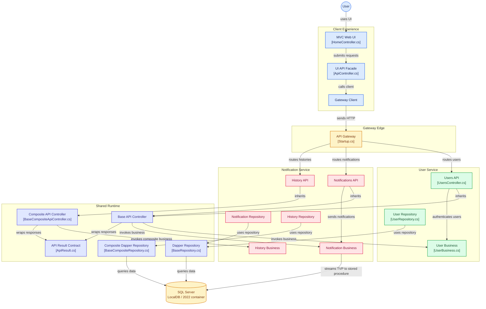

# NotificationSystem

[](https://deepwiki.com/ahmadmdabit/NotificationSystem)
[](https://dotnet.microsoft.com/)
[](LICENSE.md)

## Table of Contents

- [Overview](#overview)
- [Key Features](#key-features)
- [Architecture Diagram](#architecture-diagram)
- [Tech Stack](#tech-stack)
- [Getting Started](#getting-started)
  - [Prerequisites](#prerequisites)
  - [Installation](#installation)
  - [Running the Application](#running-the-application)
  - [Service Ports](#service-ports)
- [Project Structure](#project-structure)
- [Domain Entities](#domain-entities)
- [API Documentation](#api-documentation)
- [API Surface](#api-surface)
- [Security](#security)
- [Database](#database)
- [Error Contract](#error-contract)
- [Cross-cutting Concerns](#cross-cutting-concerns)
- [Frontend Dependencies](#frontend-dependencies)
- [CI/CD](#cicd)
- [Development](#development)
  - [Architecture Details](#architecture-details)
  - [Adding New Features](#adding-new-features)
- [License](#license)

## Overview

A modern, scalable notification system built with .NET 10 using a microservices architecture. This project demonstrates best practices in software design, including separation of concerns, clean architecture, and API gateway pattern implementation.

The application consists of multiple components:

- **Microservices**: UserService and NotificationService for handling business logic
- **API Gateway**: Centralized routing using Ocelot
- **Web UI**: MVC application with responsive design
- **Shared Libraries**: Common, DAL, BLL, and API layers for code reuse

## Key Features

- **Notification Management**: Create, send, and track notifications
- **User Management**: User registration and profile management
- **Microservices Architecture**: Independent, scalable services
- **API Gateway**: Centralized request routing and management
- **API Documentation**: Interactive Swagger UI for all services
- **Responsive UI**: Modern web interface using Bootstrap and jQuery
- **Database**: SQL Server with Dapper ORM — LocalDB for local dev, SQL Server 2022 container in Docker
- **CORS Support**: Cross-origin resource sharing enabled
- **JWT Authentication**: HMAC-SHA256 token-based auth with 7-day expiry, validated by `JwtBearer` in both services. See [Security](#security).
- **Authorization**: `[Authorize]` on `BaseApiController` — all endpoints are authenticated by default except `Register`, `Authenticate`, and `/health` (`[AllowAnonymous]`)
- **Docker Containerization**: Multi-stage alpine images, non-root execution, health checks, and app-level schema migration via `IHostedService`

## Architecture Diagram

[](https://gitdiagram.com/ahmadmdabit/NotificationSystem)


```mermaid
flowchart TD

subgraph group_clients["Client Experience"]
  node_ui_web["MVC Web UI<br/>[HomeController.cs]"]
  node_ui_api["UI API Facade<br/>[ApiController.cs]"]
  node_gateway_client["Gateway Client"]
end

subgraph group_edge["Gateway Edge"]
  node_gateway["API Gateway<br/>[Startup.cs]"]
end

subgraph group_users["User Service"]
  node_user_api["Users API<br/>[UsersController.cs]"]
  node_user_business["User Business<br/>[UserBusiness.cs]"]
  node_user_repository["User Repository<br/>[UserRepository.cs]"]
end

subgraph group_notifications["Notification Service"]
  node_notification_api["Notifications API"]
  node_history_api["History API"]
  node_notification_business["Notification Business"]
  node_history_business["History Business"]
  node_notification_repository["Notification Repository"]
  node_history_repository["History Repository"]
end

subgraph group_shared["Shared Runtime"]
  node_base_api["Base API Controller"]
  node_base_composite_api["Composite API Controller<br/>[BaseCompositeApiController.cs]"]
  node_base_repository["Dapper Repository<br/>[BaseRepository.cs]"]
  node_base_composite_repository["Composite Dapper Repository<br/>[BaseCompositeRepository.cs]"]
  node_api_result["API Result Contract<br/>[ApiResult.cs]"]
end

node_user_actor(("User"))
node_sql_server[("SQL Server<br/>LocalDB / 2022 container")]

node_user_actor -->|"uses UI"| node_ui_web
node_ui_web -->|"submits requests"| node_ui_api
node_ui_api -->|"calls client"| node_gateway_client
node_gateway_client -->|"sends HTTP"| node_gateway
node_gateway -->|"routes users"| node_user_api
node_gateway -->|"routes notifications"| node_notification_api
node_gateway -->|"routes histories"| node_history_api
node_user_api -->|"inherits"| node_base_api
node_notification_api -->|"inherits"| node_base_api
node_history_api -->|"inherits"| node_base_composite_api
node_user_api -->|"authenticates users"| node_user_business
node_notification_api -->|"sends notifications"| node_notification_business
node_base_api -->|"invokes business"| node_user_business
node_base_api -->|"invokes business"| node_notification_business
node_base_composite_api -->|"invokes composite business"| node_history_business
node_base_api -->|"wraps responses"| node_api_result
node_base_composite_api -->|"wraps responses"| node_api_result
node_base_repository -->|"queries data"| node_sql_server
node_base_composite_repository -->|"queries data"| node_sql_server
node_notification_business -->|"streams TVP to stored procedure"| node_sql_server
node_user_repository -->|"uses repository"| node_base_repository
node_notification_repository -->|"uses repository"| node_base_repository
node_history_repository -->|"uses repository"| node_base_composite_repository

click node_ui_web "https://github.com/ahmadmdabit/notificationsystem/blob/master/UI/Controllers/HomeController.cs"
click node_ui_api "https://github.com/ahmadmdabit/notificationsystem/blob/master/UI/Controllers/ApiController.cs"
click node_gateway_client "https://github.com/ahmadmdabit/notificationsystem/blob/master/UI/Services/GatewayApiClient.cs"
click node_gateway "https://github.com/ahmadmdabit/notificationsystem/blob/master/ApiGateway/Startup.cs"
click node_user_api "https://github.com/ahmadmdabit/notificationsystem/blob/master/UserService/Controllers/UsersController.cs"
click node_user_business "https://github.com/ahmadmdabit/notificationsystem/blob/master/UserService/Businesses/UserBusiness.cs"
click node_user_repository "https://github.com/ahmadmdabit/notificationsystem/blob/master/UserService/Repositories/UserRepository.cs"
click node_notification_api "https://github.com/ahmadmdabit/notificationsystem/blob/master/NotificationService/Controllers/NotificationsController.cs"
click node_history_api "https://github.com/ahmadmdabit/notificationsystem/blob/master/NotificationService/Controllers/NotificationsHistoryController.cs"
click node_notification_business "https://github.com/ahmadmdabit/notificationsystem/blob/master/NotificationService/Businesses/NotificationBusiness.cs"
click node_history_business "https://github.com/ahmadmdabit/notificationsystem/blob/master/NotificationService/Businesses/NotificationHistoryBusiness.cs"
click node_notification_repository "https://github.com/ahmadmdabit/notificationsystem/blob/master/NotificationService/Repositories/NotificationRepository.cs"
click node_history_repository "https://github.com/ahmadmdabit/notificationsystem/blob/master/NotificationService/Repositories/NotificationHistoryRepository.cs"
click node_base_api "https://github.com/ahmadmdabit/notificationsystem/blob/master/API/Controller/BaseApiController.cs"
click node_base_composite_api "https://github.com/ahmadmdabit/notificationsystem/blob/master/API/Controller/BaseCompositeApiController.cs"
click node_base_repository "https://github.com/ahmadmdabit/notificationsystem/blob/master/DAL/Repository/BaseRepository.cs"
click node_base_composite_repository "https://github.com/ahmadmdabit/notificationsystem/blob/master/DAL/Repository/BaseCompositeRepository.cs"
click node_api_result "https://github.com/ahmadmdabit/notificationsystem/blob/master/Common/Helpers/ApiResult.cs"

classDef toneNeutral fill:#f8fafc,stroke:#334155,stroke-width:1.5px,color:#0f172a
classDef toneBlue fill:#dbeafe,stroke:#2563eb,stroke-width:1.5px,color:#172554
classDef toneAmber fill:#fef3c7,stroke:#d97706,stroke-width:1.5px,color:#78350f
classDef toneMint fill:#dcfce7,stroke:#16a34a,stroke-width:1.5px,color:#14532d
classDef toneRose fill:#ffe4e6,stroke:#e11d48,stroke-width:1.5px,color:#881337
classDef toneIndigo fill:#e0e7ff,stroke:#4f46e5,stroke-width:1.5px,color:#312e81
classDef toneTeal fill:#ccfbf1,stroke:#0f766e,stroke-width:1.5px,color:#134e4a
class node_ui_web,node_ui_api,node_gateway_client,node_user_actor toneBlue
class node_gateway,node_sql_server toneAmber
class node_user_api,node_user_business,node_user_repository toneMint
class node_notification_api,node_history_api,node_notification_business,node_history_business,node_notification_repository,node_history_repository toneRose
class node_base_api,node_base_composite_api,node_base_repository,node_base_composite_repository,node_api_result toneIndigo
```

## Tech Stack

| Layer                 | Technology                                           |
| --------------------- | ---------------------------------------------------- |
| **Framework**         | ASP.NET Core 10 (net10.0)                            |
| **Architecture**      | Microservices with API Gateway                       |
| **Languages**         | C#                                                   |
| **Database**          | SQL Server 2022 (Docker) / LocalDB + Dapper ORM      |
| **API Gateway**       | Ocelot 25.0.1                                        |
| **Container**         | Docker (multi-stage alpine, non-root, health checks) |
| **Frontend**          | ASP.NET Core MVC (Bootstrap, jQuery, Grid.js)        |
| **API Documentation** | Swagger/OpenAPI                                      |
| **HTTP Client**       | RestSharp                                            |

## Getting Started

### Prerequisites

- [.NET 10 SDK](https://dotnet.microsoft.com/download/dotnet/10.0)
- Visual Studio or Visual Studio Code
- SQL Server LocalDB (included with Visual Studio) for running services locally, or Docker Desktop for the full containerized stack (SQL Server 2022 + all four services)

### Installation

1. Clone the repository:

   ```bash
   git clone https://github.com/ahmadmdabit/NotificationSystem.git
   cd NotificationSystem
   ```

2. Build the solution:
   ```bash
   dotnet build NotificationSystem.slnx
   ```

### Generating a Development Secret

The JWT signing secret is not stored in source control. Each developer must generate a local secret before first run.

**Option 1: User Secrets (recommended for development)**

```bash
# Same value in both services — they share one signing key
SECRET=$(openssl rand -hex 32)
(cd UserService && dotnet user-secrets init && dotnet user-secrets set "AppSettings:Secret" "$SECRET")
(cd NotificationService && dotnet user-secrets init && dotnet user-secrets set "AppSettings:Secret" "$SECRET")
(cd UI && dotnet user-secrets init && dotnet user-secrets set "ApiSettings:ServicePassword" "$(openssl rand -hex 16)")
```

**Option 2: Environment variables**

```bash
# PowerShell
$env:AppSettings__Secret = "$(openssl rand -hex 32)"

# bash
export AppSettings__Secret="$(openssl rand -hex 32)"
```

**Option 3: appsettings.Development.json (gitignored by default)**

Create `UserService/appsettings.Development.json`:

```json
{
  "AppSettings": {
    "Secret": "<64-char-hex-string>",
    "SqlConnectionString": "..."
  }
}
```

**Production:** Inject via environment variable or secret vault (Azure Key Vault, etc.). Never commit secrets.

**Verification:** After setting the secret, `dotnet run --environment Development` on UserService should not throw on `AppSettings.Secret`.

### Running the Application

**Option 1: Local development (no Docker)**

1. Generate and set the shared JWT signing secret plus the UI BFF password:

   ```bash
   export JWT_SECRET=$(openssl rand -hex 32)
   export AppSettings__Secret=$JWT_SECRET
   export ApiSettings__ServicePassword=$(openssl rand -hex 16)
   export SQL_SA_PASSWORD=ChangeMe@123!
   ```

   Or use User Secrets per project (see [Generating a Development Secret](#generating-a-development-secret)).

2. Start the microservices in separate terminals:
   ```bash
   cd UserService && dotnet run
   cd NotificationService && dotnet run
   cd ApiGateway && dotnet run
   cd UI && dotnet run
   ```

**Option 2: Docker Compose (recommended)**

1. Ensure Docker is available (this project assumes Docker inside WSL2 Ubuntu). Generate `.env` from `.env.example` and set secrets:

   ```bash
   cp .env.example .env
   # Edit .env: set SQL_SA_PASSWORD, JWT_SECRET, and UI_SERVICE_PASSWORD
   python3 -c "import secrets; print(secrets.token_hex(32))"
   ```

2. Start the full stack:

   ```bash
   docker compose up -d --build
   ```

3. Check health:
   ```bash
   docker compose ps  # all 5 services should report (healthy)
   ```

**Option 3: Development watch**

```bash
cd UserService && dotnet watch run
cd NotificationService && dotnet watch run
cd ApiGateway && dotnet watch run
cd UI && dotnet watch run
```

| Service             | Host (Compose)                            | URL (local dev)           |
| ------------------- | ----------------------------------------- | ------------------------- |
| UserService         | `http://localhost:8081/api/Users`         | `https://localhost:44344` |
| NotificationService | `http://localhost:8081/api/Notifications` | `https://localhost:44314` |
| ApiGateway          | `http://localhost:8081`                   | `https://localhost:44315` |
| UI                  | `http://localhost:8080`                   | `https://localhost:44315` |
| SQL Server          | (not published — internal only)           | n/a                       |

## Project Structure

```
├── Common/
│   └── Common Library (net10.0) - Helpers, Extensions
├── DAL/
│   └── DAL Library (net10.0) - Dapper & SQL Server (base classes, DatabaseMigrationBase)
├── BLL/
│   └── BLL Library (net10.0) - Business logic interfaces & base
├── API/
│   └── API Library (net10.0) - Swagger, base controllers
├── Services/
│   ├── UserService (ASP.NET Core 10 RESTful API)
│   └── NotificationService (ASP.NET Core 10 RESTful API)
├── ApiGateway/ (Ocelot API Gateway)
└── UI/ (ASP.NET Core 10 MVC - Bootstrap/jQuery/Grid.js)
    └── Services/ (GatewayApiClient, IGatewayApiClient - BFF pattern)
```

## Domain Entities

| Entity              | Location                                              | Key Fields                                      |
| ------------------- | ----------------------------------------------------- | ----------------------------------------------- |
| User                | `UserService/Entities/User.cs`                        | Id, Username, PasswordHash, PasswordSalt, Token |
| Notification        | `NotificationService/Entities/Notification.cs`        | Id, Title, Content                              |
| NotificationHistory | `NotificationService/Entities/NotificationHistory.cs` | NotificationId (PK), UserId (PK), CreatedAt     |

**NotificationHistory** uses a composite key (`NotificationId` + `UserId`) to track which users have received which notifications.

## API Documentation

Each microservice includes interactive Swagger documentation:

- **UserService**: `https://localhost:44344/swagger`
- **NotificationService**: `https://localhost:44314/swagger`

The documentation provides:

- Complete endpoint list
- Request/response schemas
- Interactive testing interface

## API Surface

All endpoints are async-only and authenticated by default (`[Authorize]` on `BaseApiController`). `Register` and `Authenticate` carry `[AllowAnonymous]`. `/health` is anonymous because it is not a controller action. The following endpoints are exposed beyond standard CRUD:

| Endpoint                                   | Method      | Description                                                      |
| ------------------------------------------ | ----------- | ---------------------------------------------------------------- |
| `/api/Users/Register`                      | POST        | Register a new user                                              |
| `/api/Users/Authenticate`                  | POST        | Authenticate and receive JWT                                     |
| `/api/Notifications/Send`                  | POST        | Send notifications to users (via stored procedure)               |
| `/api/[controller]/Bulk`                   | POST        | Bulk insert entities                                             |
| `/api/NotificationHistories/{key1}/{key2}` | GET, DELETE | Composite-key lookup/delete (two-part primary key)               |
| `/health`                                  | GET         | Liveness probe (anonymous; used by Docker Compose health checks) |

**Error Contract note:** error responses now use real HTTP status codes — `400` for bad input (e.g. duplicate username on Register), `401` for unauthenticated access. The JSON body shape (`success: false` + `ErrorResult`) is unchanged for clients that inspect `success`.

## Security

Authentication uses JWT tokens with the following characteristics:

- **Algorithm**: HMAC-SHA256
- **Expiry**: 7 days
- **Password Hashing**: PBKDF2 (`Rfc2898DeriveBytes`, HMAC-SHA512, 600,000 iterations, 256-bit salt) with constant-time verification (`CryptographicOperations.FixedTimeEquals`) in `UserService/Businesses/UserBusiness.cs`
- **Token Generation**: `UsersController.TokenGenerate()` in `UserService/Controllers/UsersController.cs`
- **Token Validation**: All endpoints are authenticated by default (`[Authorize]` on `BaseApiController` in `API/Controller/BaseApiController.cs`). `Register`, `Authenticate`, and `/health` remain anonymous. JWT validation is wired in both `UserService/Startup.cs` and `NotificationService/Startup.cs`.
- **Shared Secret**: Both services must use the same `AppSettings:Secret` value. Inject one `JWT_SECRET` (see [.env.example](.env.example)) — compose maps it into both services. Do not generate two keys.
- **Username Uniqueness**: A unique nonclustered index (`UXUsersUsername`) on `Users(Username)` enforces uniqueness at the database level, closing the check-then-act race on concurrent registration.
- **UI BFF**: The MVC UI never prompts for a user login. `UI/Services/GatewayApiClient` (implementing `IGatewayApiClient`, registered as singleton) registers/authenticates a service account (`ApiSettings:ServiceUsername` / `ServicePassword`, compose: `UI_SERVICE_PASSWORD`) and attaches an HTTP Authorization Bearer header on every gateway call. The client caches the token with an expiry timestamp (thundering-herd-safe refresh via `SemaphoreSlim` double-check), refreshes on 401, and disposes its `SemaphoreSlim` on shutdown.

## Database

- **Engine**: SQL Server (LocalDB for local dev, SQL Server 2022 container in Docker)
- **ORM**: Dapper 2.1.86
- **Databases**: `UserDB` (UserService) and `NotificationDB` (NotificationService) — one per service, created on demand
- **Connection**: Configured via `AppSettings.SqlConnectionString` in each service's `appsettings.json`. Local dev (`appsettings.Development.json`) uses `Data Source=(LocalDB)\MSSQLLocalDB;Database=<DbName>;Integrated Security=True`; Docker injects `Server=sqlserver;Database=...;User Id=sa;Password=${SQL_SA_PASSWORD}` via `docker-compose.yml`
- **Database name**: always resolved from `Initial Catalog`/`Database` in the connection string — `DAL.DatabaseMigrationBase` reads it to create the database (reconnecting to `master` for the `CREATE DATABASE` step), so a connection string without an explicit catalog fails migration with `CREATE DATABASE []`
- **Schema**: Created automatically at service startup by `DatabaseMigration` (`IHostedService` in `UserService/Startup.cs` / `NotificationService/Startup.cs`), inheriting from `DAL.DatabaseMigrationBase` which handles database creation and retry logic. No external init scripts and no committed database files: the former `App_Data/*.mdf` LocalDB files were removed from source control, and `*.mdf` / `*.ldf` are ignored via [.gitignore](.gitignore)

### Resetting the Databases

`DatabaseMigrationBase` only creates what does not exist yet (`IF NOT EXISTS` for databases, tables and types; `CREATE OR ALTER` for procedures), so a reset means dropping the databases and letting the services recreate them on the next start. **Always rebuild the images when resetting Docker** — the migration code ships inside the image, so booting a stale image against a wiped volume re-creates the stale schema.

> **Disk space matters on the Docker host.** Images and volumes live inside the WSL distro's virtual disk (e.g. `%LOCALAPPDATA%\Packages\CanonicalGroupLimited.Ubuntu_*\LocalState\ext4.vhdx`), which cannot grow once its host drive is full. Linux then remounts the filesystem **read-only**, so container health checks fail with `OCI runtime exec failed: ... read-only file system` and migrations fail with `operating system error 112 (There is not enough space on the disk)`. Free space (or run `docker system prune`) before a full reset.

**Docker — full reset (discards all data, including the SQL volume):**

```bash
docker compose down -v
docker compose up -d --build
```

**Docker — drop and recreate the databases only (keeps the SQL volume):**

```bash
docker compose stop userservice notificationservice
docker exec -it notificationsystem-sql /opt/mssql-tools18/bin/sqlcmd -S localhost -U sa -C -Q \
  "ALTER DATABASE [UserDB] SET SINGLE_USER WITH ROLLBACK IMMEDIATE; DROP DATABASE [UserDB];
   ALTER DATABASE [NotificationDB] SET SINGLE_USER WITH ROLLBACK IMMEDIATE; DROP DATABASE [NotificationDB];"
docker compose up -d --build userservice notificationservice
```

`SINGLE_USER WITH ROLLBACK IMMEDIATE` is required to release the pooled connections held by the running services.

**Local dev — reset the LocalDB databases:**

```powershell
sqllocaldb stop MSSQLLocalDB
sqlcmd -S "(localdb)\MSSQLLocalDB" -E -Q "DROP DATABASE IF EXISTS UserDB; DROP DATABASE IF EXISTS NotificationDB;"
```

**Integration tests** — `docker-compose.test.yml` is throwaway (no named volume, and it declares its own Compose project name so `down -v` cannot touch the main stack): `docker compose -f docker-compose.test.yml down -v`.

**Verification** (after a reset, both databases must contain the current object names):

```bash
docker exec -e SQLCMDPASSWORD="$SQL_SA_PASSWORD" notificationsystem-sql \
  /opt/mssql-tools18/bin/sqlcmd -S localhost -U sa -C -d UserDB \
  -Q "SELECT name, is_unique FROM sys.indexes WHERE object_id = OBJECT_ID('dbo.Users');"

docker exec -e SQLCMDPASSWORD="$SQL_SA_PASSWORD" notificationsystem-sql \
  /opt/mssql-tools18/bin/sqlcmd -S localhost -U sa -C -d NotificationDB \
  -Q "SELECT name FROM sys.procedures; SELECT name FROM sys.types WHERE is_user_defined = 1;"
```

Expected: `UXUsersUsername` with `is_unique = 1` (plus the clustered PK) in `UserDB`, and `SPNotificationHistoryInsert` + `TypeNotificationHistory` in `NotificationDB`. Legacy names (`SP_NotificationHistory_I`, `Type_NotificationHistory`, missing `UXUsersUsername`) mean a stale image created the schema.

A reset must also be verified at the gateway, because a correct schema behind an unroutable gateway still fails every request:

```bash
docker exec notificationsystem-apigateway head -3 /app/ocelot.json    # must contain "Routes": [ (not "ReRoutes")
curl -s -o /dev/null -w '%{http_code}\n' http://localhost:8081/Users   # 401 = routed and authenticated, 404 = no route matched
```

`404` on every gateway path (with `UnableToFindDownstreamRouteError` in `docker logs notificationsystem-apigateway`) means the loaded config still uses the legacy `ReRoutes` key.

### Stored Procedures

The notification send operation uses `[dbo].[SPNotificationHistoryInsert]` with a Table-Valued Parameter of type `[dbo].[TypeNotificationHistory]`. The TVP is streamed via `TvpStreamingExtensions.AsSqlDataRecords()` with the column mapping defined in `NotificationService/Data/Tvp/NotificationHistoryTvpDefinition.cs` (single reusable `SqlDataRecord`, no `DataTable` materialization).

## Error Contract

All API errors return a standardized `ErrorResult` object:

```json
{
  "success": false,
  "error": {
    "code": 0,
    "message": "Description",
    "stackTrace": "...",
    "innerMessage": "...",
    "innerStackTrace": "..."
  }
}
```

Defined in `Common/Helpers/ErrorResult.cs`.

## Cross-cutting Concerns

- **IP Logging**: `BaseApiController` resolves the client IP per request from `HttpContext.Connection.RemoteIpAddress` (populated by `UseForwardedHeaders` middleware in each service `Startup.cs`); null-safe with `"Unknown"` fallback
- **CORS**: Pinned to the UI origin via `WithOrigins()` in each service `Startup.cs` (was `AllowAnyOrigin` — tightened to prevent direct cross-service access). The UI is a same-origin server-side proxy; browser clients never call the services directly.
- **Error Contract**: `ErrorResult` redacts `StackTrace`/`InnerStackTrace` in Production environments (details only in non-production), preventing stack-trace disclosure to API clients

## Frontend Dependencies

- **RestSharp** (`114.0.0`): UI calls the API gateway via `GatewayApiClient` (`ApiSettings:GatewayBaseUrl`; Docker: `http://apigateway:8080`; local dev: `https://localhost:44315` in `UI/appsettings.json`)
- **Grid.js**: Loaded from CDN in `UI/Views/Home/Index.cshtml` for notification history display
- **Anti-forgery**: `[ValidateAntiForgeryToken]` on POST endpoints; token injected via `@inject Microsoft.AspNetCore.Antiforgery.IAntiforgery`

## CI/CD

The project includes a GitHub Actions workflow (`.github/workflows/docker-build.yml`) that builds and pushes all four service images to Docker Hub on every push to `master`:

- `ahmadmdabit/notificationsystem-userservice`
- `ahmadmdabit/notificationsystem-notificationservice`
- `ahmadmdabit/notificationsystem-apigateway`
- `ahmadmdabit/notificationsystem-ui`

Each image is tagged with `latest` and the commit SHA. Build caching uses GitHub Actions cache (`type=gha`).

### Docker Compose Test Environment

`docker-compose.test.yml` provides an isolated, fail-fast SQL Server instance for integration tests. It uses `restart: "no"` and no named volume to ensure a clean database state on every run, and declares its own Compose project name (`notificationsystem-test`) so a `down -v` scoped to it cannot remove the main stack's containers or SQL volume. App services are intentionally excluded — tests connect to this SQL Server directly.

## Development

### Architecture Details

This N-Tier architecture uses a **layered diaspora** pattern:

1. **Common Layer**: Shared helpers (`ApiResult<T>`, `ErrorResult`, `AppSettings`, `SpResult`)
2. **DAL Layer**: `IEntity<TSelf, TKey>` / `ICompositeEntity<TSelf, TKey1, TKey2>` contracts with compile-time static metadata (table/key names, zero reflection at runtime); `IRepository<T, TKey>` + `BaseRepository<T, TKey>` and `ICompositeRepository<T, TKey1, TKey2>` + `BaseCompositeRepository<T, TKey1, TKey2>` with precomputed SQL, `FrozenSet` property whitelists, and shared projection validation; `DatabaseMigrationBase` for schema creation; `AddDAL()` DI extension; TVP streaming (`ITvpDefinition<T>`, `TvpStreamingExtensions`)
3. **BLL Layer**: `IBusiness<T, TKey>` + `BaseBusiness<T, TKey>` and `ICompositeBusiness<T, TKey1, TKey2>` + `BaseCompositeBusiness<T, TKey1, TKey2>` abstract classes
4. **API Layer**: `IApiController<T, TKey>` + `BaseApiController<T, TKey>` and `ICompositeApiController<T, TKey1, TKey2>` + `BaseCompositeApiController<T, TKey1, TKey2>` with standardized CRUD endpoints (authenticated by default via `[Authorize]`); composite entities route as `/{key1}/{key2}`
5. **Services**: Concrete entities, repositories, business logic, and controllers live in `UserService/` and `NotificationService/`
6. **ApiGateway**: Ocelot 25.x routing via `ocelot.json` (single source; `ocelot.Development.json` overrides for local dev). Route arrays must be named `Routes` — the legacy `ReRoutes` key inherited from Ocelot 15.x is silently ignored, so a mismatch only shows up at request time as HTTP 404 with `UnableToFindDownstreamRouteError`
7. **UI**: MVC frontend calling the gateway via RestSharp

The shared libraries contain only base classes and interfaces. Concrete implementations (entities, repositories, business classes, controllers) reside in the service projects that use them.

### Adding New Features

1. Define the entity in the service's `Entities/` folder (e.g., `NotificationService/Entities/`)
2. Create repository interface in `DAL/Repository/` (if new generic contract needed)
3. Implement concrete repository in the service's `Repositories/` folder
4. Create business interface in `BLL/Business/` (if new generic contract needed)
5. Implement concrete business class in the service's `Businesses/` folder
6. Add controller in the service's `Controllers/` folder (inherit from `BaseApiController<T>`)
7. Register services in the microservice's `Startup.cs`
8. Add routing in `ApiGateway/ocelot.json` **under the `Routes` array** (single source; `ocelot.Development.json` overrides for local dev). Do not use the legacy `ReRoutes` key — Ocelot 25.x ignores it and every gateway call returns 404
9. Create UI pages if needed

## License

Licensed under the [MIT license](LICENSE.md).
