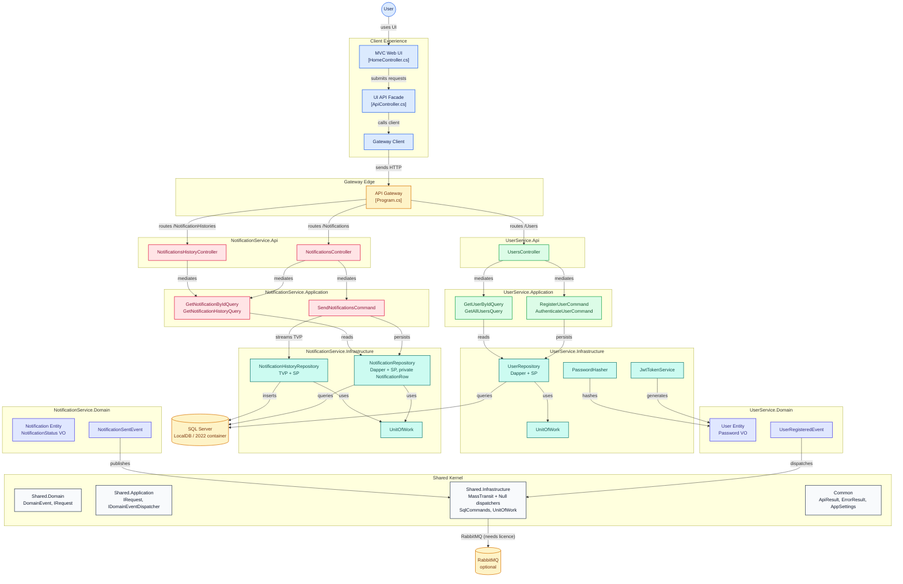

# NotificationSystem

[](https://deepwiki.com/ahmadmdabit/NotificationSystem)
[](https://dotnet.microsoft.com/)
[](LICENSE.md)

## Table of Contents

- [Overview](#overview)
- [Key Features](#key-features)
- [Architecture Diagram](#architecture-diagram)
- [Tech Stack](#tech-stack)
- [Getting Started](#getting-started)
  - [Prerequisites](#prerequisites)
  - [Installation](#installation)
  - [Running the Application](#running-the-application)
  - [Service Ports](#service-ports)
- [Project Structure](#project-structure)
- [Domain Entities](#domain-entities)
- [API Documentation](#api-documentation)
- [API Surface](#api-surface)
- [Security](#security)
- [Database](#database)
- [Error Contract](#error-contract)
- [Cross-cutting Concerns](#cross-cutting-concerns)
- [Messaging & Dispatch](#messaging--dispatch)
- [Frontend Dependencies](#frontend-dependencies)
- [CI/CD](#cicd)
- [Development](#development)
  - [Architecture Details](#architecture-details)
  - [Testing](#testing)
  - [Two guards worth knowing about](#two-guards-worth-knowing-about)
  - [Verifying a test actually guards something](#verifying-a-test-actually-guards-something)
  - [TUnit rules this codebase has tripped over](#tunit-rules-this-codebase-has-tripped-over)
  - [Adding New Features](#adding-new-features)
- [License](#license)

## Overview

A modern, scalable notification system built with .NET 10 using a microservices architecture. This project demonstrates best practices in software design, including Clean Architecture, CQRS, DDD, and API gateway pattern implementation.

The application consists of multiple components:

- **Microservices**: UserService and NotificationService for handling business logic
- **API Gateway**: Centralized routing using Ocelot
- **Web UI**: MVC application with responsive design
- **Shared Kernel**: Shared.Api, Shared.Domain, Shared.Application, Shared.Infrastructure
- **Architecture Tests**: ArchUnitNET-based dependency rule enforcement

## Key Features

- **Notification Management**: Create, send, and track notifications
- **User Management**: User registration and profile management
- **Microservices Architecture**: Independent, scalable services
- **API Gateway**: Centralized request routing and management
- **API Documentation**: Interactive Swagger UI for all services
- **Responsive UI**: Modern web interface using Bootstrap and jQuery
- **Database**: SQL Server with Dapper ORM — LocalDB for local dev, SQL Server 2022 container in Docker
- **CORS Support**: Cross-origin resource sharing enabled
- **JWT Authentication**: HMAC-SHA256 token-based auth with 7-day expiry, validated by `JwtBearer` in both services. See [Security](#security).
- **Authorization**: `[Authorize]` on `BaseApiController` — all endpoints are authenticated by default except `Register`, `Authenticate`, and `/health` (`[AllowAnonymous]`)
- **Docker Containerization**: Multi-stage alpine images, non-root execution, health checks, and app-level schema migration via `IHostedService`

## Architecture Diagram


```mermaid
flowchart TD

subgraph group_clients["Client Experience"]
  node_ui_web["MVC Web UI<br/>[HomeController.cs]"]
  node_ui_api["UI API Facade<br/>[ApiController.cs]"]
  node_gateway_client["Gateway Client"]
end

subgraph group_edge["Gateway Edge"]
  node_gateway["API Gateway<br/>[Program.cs]"]
end

subgraph group_user_api["UserService.Api"]
  node_user_api["UsersController"]
end

subgraph group_user_app["UserService.Application"]
  node_user_cmd["RegisterUserCommand<br/>AuthenticateUserCommand"]
  node_user_query["GetUserByIdQuery<br/>GetAllUsersQuery"]
end

subgraph group_user_infra["UserService.Infrastructure"]
  node_user_repo["UserRepository<br/>Dapper + SP"]
  node_user_uow["UnitOfWork"]
  node_user_jwt["JwtTokenService"]
  node_user_pwd["PasswordHasher"]
end

subgraph group_user_domain["UserService.Domain"]
  node_user_entity["User Entity<br/>Password VO"]
  node_user_event["UserRegisteredEvent"]
end

subgraph group_notif_api["NotificationService.Api"]
  node_notif_api["NotificationsController"]
  node_history_api["NotificationsHistoryController"]
end

subgraph group_notif_app["NotificationService.Application"]
  node_notif_cmd["SendNotificationsCommand"]
  node_notif_query["GetNotificationByIdQuery<br/>GetNotificationHistoryQuery"]
end

subgraph group_notif_infra["NotificationService.Infrastructure"]
  node_notif_repo["NotificationRepository<br/>Dapper + SP, private NotificationRow"]
  node_history_repo["NotificationHistoryRepository<br/>TVP + SP"]
  node_notif_uow["UnitOfWork"]
end

subgraph group_notif_domain["NotificationService.Domain"]
  node_notif_entity["Notification Entity<br/>NotificationStatus VO"]
  node_notif_event["NotificationSentEvent"]
end

subgraph group_shared["Shared Kernel"]
  node_shared_domain["Shared.Domain<br/>DomainEvent, IRequest"]
  node_shared_app["Shared.Application<br/>IRequest, IDomainEventDispatcher"]
  node_shared_infra["Shared.Infrastructure<br/>MassTransit + Null dispatchers<br/>SqlCommands, UnitOfWork"]
  node_common["Common<br/>ApiResult, ErrorResult, AppSettings"]
end

node_user_actor(("User"))
node_sql_server[("SQL Server<br/>LocalDB / 2022 container")]
node_rabbitmq[("RabbitMQ<br/>optional")]

node_user_actor -->|"uses UI"| node_ui_web
node_ui_web -->|"submits requests"| node_ui_api
node_ui_api -->|"calls client"| node_gateway_client
node_gateway_client -->|"sends HTTP"| node_gateway
node_gateway -->|"routes /Users"| node_user_api
node_gateway -->|"routes /Notifications"| node_notif_api
node_gateway -->|"routes /NotificationHistories"| node_history_api
node_user_api -->|"mediates"| node_user_cmd
node_user_api -->|"mediates"| node_user_query
node_user_cmd -->|"persists"| node_user_repo
node_user_query -->|"reads"| node_user_repo
node_user_repo -->|"uses"| node_user_uow
node_user_jwt -->|"generates"| node_user_entity
node_user_pwd -->|"hashes"| node_user_entity
node_user_event -->|"dispatches"| node_shared_infra
node_notif_api -->|"mediates"| node_notif_cmd
node_notif_api -->|"mediates"| node_notif_query
node_history_api -->|"mediates"| node_notif_query
node_notif_cmd -->|"persists"| node_notif_repo
node_notif_cmd -->|"streams TVP"| node_history_repo
node_notif_query -->|"reads"| node_notif_repo
node_notif_repo -->|"uses"| node_notif_uow
node_history_repo -->|"uses"| node_notif_uow
node_notif_event -->|"publishes"| node_shared_infra
node_shared_infra -->|"RabbitMQ (needs licence)"| node_rabbitmq
node_user_repo -->|"queries"| node_sql_server
node_notif_repo -->|"queries"| node_sql_server
node_history_repo -->|"inserts"| node_sql_server

classDef toneNeutral fill:#f8fafc,stroke:#334155,stroke-width:1.5px,color:#0f172a
classDef toneBlue fill:#dbeafe,stroke:#2563eb,stroke-width:1.5px,color:#172554
classDef toneAmber fill:#fef3c7,stroke:#d97706,stroke-width:1.5px,color:#78350f
classDef toneMint fill:#dcfce7,stroke:#16a34a,stroke-width:1.5px,color:#14532d
classDef toneRose fill:#ffe4e6,stroke:#e11d48,stroke-width:1.5px,color:#881337
classDef toneIndigo fill:#e0e7ff,stroke:#4f46e5,stroke-width:1.5px,color:#312e81
classDef toneTeal fill:#ccfbf1,stroke:#0f766e,stroke-width:1.5px,color:#134e4a
class node_ui_web,node_ui_api,node_gateway_client,node_user_actor toneBlue
class node_gateway,node_sql_server,node_rabbitmq toneAmber
class node_user_api,node_user_cmd,node_user_query toneMint
class node_user_infra,node_user_repo,node_user_uow,node_user_jwt,node_user_pwd toneTeal
class node_user_domain,node_user_entity,node_user_event toneIndigo
class node_notif_api,node_history_api,node_notif_cmd,node_notif_query toneRose
class node_notif_infra,node_notif_repo,node_history_repo,node_notif_uow toneTeal
class node_notif_domain,node_notif_entity,node_notif_event toneIndigo
class node_shared_domain,node_shared_app,node_shared_infra,node_common toneNeutral
```

## Tech Stack

| Layer                  | Technology                                                                                                                                                                    |
| ---------------------- | ----------------------------------------------------------------------------------------------------------------------------------------------------------------------------- |
| **Framework**          | ASP.NET Core 10 (net10.0)                                                                                                                                                     |
| **Architecture**       | Clean Architecture + CQRS + DDD, Microservices                                                                                                                                |
| **Languages**          | C#                                                                                                                                                                            |
| **Database**           | SQL Server 2022 (Docker) / LocalDB + Dapper                                                                                                                                   |
| **API Gateway**        | Ocelot 25.0.1                                                                                                                                                                 |
| **Container**          | Docker (multi-stage alpine, non-root, health checks)                                                                                                                          |
| **Frontend**           | ASP.NET Core MVC (Bootstrap, jQuery, Grid.js)                                                                                                                                 |
| **API Documentation**  | Swagger/OpenAPI                                                                                                                                                               |
| **HTTP Client**        | RestSharp                                                                                                                                                                     |
| **Messaging**          | MassTransit 9.2.2 (in-memory / RabbitMQ), post-commit domain event dispatch — **commercially licensed; a key is required** (see [Messaging & Dispatch](#messaging--dispatch)) |
| **Validation**         | FluentValidation                                                                                                                                                              |
| **Architecture Tests** | ArchUnitNET (TUnit adapter)                                                                                                                                                   |

## Getting Started

### Prerequisites

- [.NET 10 SDK](https://dotnet.microsoft.com/download/dotnet/10.0)
- Visual Studio or Visual Studio Code
- SQL Server LocalDB (included with Visual Studio) for running services locally, or Docker Desktop for the full containerized stack (SQL Server 2022 + all four services)

### Installation

1. Clone the repository:

   ```bash
   git clone https://github.com/ahmadmdabit/NotificationSystem.git
   cd NotificationSystem
   ```

2. Build the solution:
   ```bash
   dotnet build NotificationSystem.slnx
   ```

### Generating a Development Secret

The JWT signing secret is not stored in source control. Each developer must generate a local secret before first run.

**Option 1: User Secrets (recommended for development)**

```bash
# Same value in both services — they share one signing key
SECRET=$(openssl rand -hex 64)
(cd Services/UserService/UserService.Api && dotnet user-secrets init && dotnet user-secrets set "AppSettings:Secret" "$SECRET")
(cd Services/NotificationService/NotificationService.Api && dotnet user-secrets init && dotnet user-secrets set "AppSettings:Secret" "$SECRET")
(cd Presentation/UI && dotnet user-secrets init && dotnet user-secrets set "ApiSettings:ServicePassword" "$(openssl rand -hex 16)")
```

**Option 2: Environment variables**

```bash
# PowerShell
$env:AppSettings__Secret = "$(openssl rand -hex 64)"

# bash
export AppSettings__Secret="$(openssl rand -hex 64)"
```

**Option 3: appsettings.Development.json (gitignored by default)**

Create `Services/UserService/UserService.Api/appsettings.Development.json`:

```json
{
  "AppSettings": {
    "Secret": "<64-char-hex-string>",
    "SqlConnectionString": "..."
  }
}
```

**Production:** Inject via environment variable or secret vault (Azure Key Vault, etc.). Never commit secrets.

**Verification:** After setting the secret, `dotnet run --environment Development` on UserService should not throw on `AppSettings.Secret`.

### Running the Application

**Option 1: Local development (no Docker)**

1. Generate and set the shared JWT signing secret plus the UI BFF password:

   ```bash
   export JWT_SECRET=$(openssl rand -hex 64)
   export AppSettings__Secret=$JWT_SECRET
   export ApiSettings__ServicePassword=$(openssl rand -hex 16)
   export SQL_SA_PASSWORD=ChangeMe@123!
   ```

   Or use User Secrets per project (see [Generating a Development Secret](#generating-a-development-secret)).

2. Start the microservices in separate terminals:
   ```bash
   cd Services/UserService/UserService.Api && dotnet run
   cd Services/NotificationService/NotificationService.Api && dotnet run
   cd Services/ApiGateway && dotnet run
   cd Presentation/UI && dotnet run
   ```

**Option 2: Docker Compose (recommended)**

1. Ensure Docker is available (this project assumes Docker inside WSL2 Ubuntu — `wsl -d ubuntu -- docker` if it is not on your Windows `PATH`). Generate `.env` from `.env.example` and set secrets:

   ```bash
   cp .env.example .env
   # Edit .env and set ALL of these — any empty one stops the stack from starting:
   #   SQL_SA_PASSWORD
   #   JWT_SECRET
   #   UI_SERVICE_PASSWORD
   #   RABBITMQ_USER        # non-default: RabbitMQ refuses remote logins for 'guest'
   #   RABBITMQ_PASSWORD
   python3 -c "import secrets; print(secrets.token_hex(32))"
   ```

   > ⚠️ **`RABBITMQ_USER` / `RABBITMQ_PASSWORD` are the most commonly missed step.** Compose
   > declares both as required, so an empty value fails _interpolation_ before a single container
   > starts — the error names the missing variable rather than anything about your code. They must
   > be non-`guest`: RabbitMQ's `guest` account is loopback-only and is refused over the compose
   > bridge network.

2. **MassTransit licence (required).** `MassTransit` 9.2.2 is commercially licensed and throws at bus
   creation without a key — see [Messaging & Dispatch](#messaging--dispatch). Put the key file at
   `~/.dotnet/MassTransit/license.txt` (override the host path with `MASSTRANSIT_LICENSE_FILE`) —
   **create the file first**, because compose bind-mounts that path unconditionally.
   Compose mounts it read-only and sets `MT_LICENSE_PATH`. Alternatively set
   `MESSAGING_ENABLED=false` to start the stack with messaging off (events are dropped, not queued);
   note that this is the **compose** variable — a `Messaging__Enabled` line in `.env` is ignored.

3. Start the full stack:

   ```bash
   docker compose up -d --build
   ```

4. Check health:
   ```bash
   docker compose ps  # all services should report (healthy)
   ```

**Option 3: Development watch**

```bash
cd Services/UserService/UserService.Api && dotnet watch run
cd Services/NotificationService/NotificationService.Api && dotnet watch run
cd Services/ApiGateway && dotnet watch run
cd Presentation/UI && dotnet watch run
```

### Service Ports

| Service             | Host (Compose)                            | URL (local dev, `dotnet run`) |
| ------------------- | ----------------------------------------- | ----------------------------- |
| UserService         | `http://localhost:8081/api/Users`         | `https://localhost:44344`     |
| NotificationService | `http://localhost:8081/api/Notifications` | `https://localhost:44314`     |
| ApiGateway          | `http://localhost:8081`                   | `https://localhost:5001`      |
| UI                  | `http://localhost:8080`                   | `https://localhost:5001` ⚠️   |
| SQL Server          | (not published — internal only)           | n/a                           |

Ports come from each project's `Properties/launchSettings.json`, not from this table — that file is
the source of truth. Two things to know before running everything locally:

- ⚠️ **`ApiGateway` and `UI` both bind `https://localhost:5001` / `http://localhost:5000`.** Running
  both with `dotnet run` at the same time will fail with an address-in-use error. Override one of
  them, e.g. `dotnet run --urls https://localhost:5002;http://localhost:5003`.
- ⚠️ **`UI`'s `ApiSettings:GatewayBaseUrl` is `https://localhost:44315`** (`Presentation/UI/appsettings.json`),
  but `ApiGateway`'s launch profile binds `5001`. The UI cannot reach the gateway until one of the
  two is changed. This is a pre-existing local-dev mismatch, not a Docker-path problem — in Compose
  the UI calls `http://apigateway:8080` and is unaffected.

## Project Structure

```
├── Shared/
│   ├── Shared.Api/                  # ApiResult, ErrorResult, ApiExceptionHandler, MessagingHealthCheck
│   ├── Shared.Domain/               # DomainEvent, IDomainEventDispatcher, DomainEventCollector
│   ├── Shared.Application/          # IRequest markers, CommonBehavior pipeline, AppSettings (Shared.Helpers)
│   └── Shared.Infrastructure/       # MassTransitDomainEventDispatcher, NullDomainEventDispatcher, UnitOfWork, DatabaseMigrationBase, DapperConfiguration, Persistence/SqlCommands
├── Services/
│   ├── UserService/
│   │   ├── UserService.Domain/          # User entity, Password VO, UserRegisteredEvent, repository interfaces
│   │   ├── UserService.Application/     # CQRS commands/queries, DTOs, FluentValidation, behaviors
│   │   ├── UserService.Infrastructure/  # Dapper repositories (execute only), Persistence/*CommandFactory, UnitOfWork, JwtTokenService, PasswordHasher, MassTransit
│   │   └── UserService.Api/             # Controllers, Program.cs, JWT auth
│   ├── NotificationService/
│   │   ├── NotificationService.Domain/          # Notification entity, NotificationStatus VO, NotificationSentEvent
│   │   ├── NotificationService.Application/     # CQRS commands/queries, DTOs, FluentValidation, behaviors
│   │   ├── NotificationService.Infrastructure/  # Dapper repositories (execute only), Persistence/*CommandFactory, TVP, UnitOfWork, MassTransit publisher
│   │   └── NotificationService.Api/             # Controllers, Program.cs, JWT auth
│   └── ApiGateway/                      # Ocelot API Gateway
├── Presentation/
│   └── UI/                              # ASP.NET Core 10 MVC (Bootstrap/jQuery/Grid.js)
│       └── Services/                    # GatewayApiClient, IGatewayApiClient - BFF pattern
└── Tests/
    ├── ArchitectureTests/             # ArchUnitNET dependency rule tests (TUnit adapter)
    ├── WiringTests/                   # DI resolution + stored-procedure contract guards (TUnit; scans production source)
    └── UnitTests/
        ├── UserService.Tests/         # User command/query/handler/validator, domain, infrastructure, API controller tests
        ├── NotificationService.Tests/ # Notification command/query/handler/validator, domain, infrastructure, API controller tests
        ├── Shared.Tests/              # ApiResult, ErrorResult redaction, ApiExceptionHandler, MessagingHealthCheck, pipeline behaviors, UnitOfWork, DomainEventCollector, SqlCommands
        ├── UI.Tests/                  # Controllers, GatewayApiClient token lifecycle, Startup DI, ErrorViewModel
        └── TestDoubles/               # Mocks/ (repos, UoW, mediator, security, gateway client) + Stubs/ (InMemoryUserRepository, SyncHasher, TestDomainEvent) + Helpers/ (SqlException, TestHostEnvironment, HttpContext, CommandParameterNames, fixtures)
```

## Domain Entities

| Entity       | Location                                                                           | Key Fields                              |
| ------------ | ---------------------------------------------------------------------------------- | --------------------------------------- |
| User         | `Services/UserService/UserService.Domain/Entities/User.cs`                         | Id, Username, Password (VO), CreatedAt  |
| Notification | `Services/NotificationService/NotificationService.Domain/Entities/Notification.cs` | Id, Title, Content, Status (VO), SentAt |

**`NotificationHistory` is not a domain entity.** It lives at
`Services/NotificationService/NotificationService.Domain/NotificationHistory.cs` — inside the Domain
_project_, but deliberately **not** a domain entity (no behavior) and **not** a value object (it has
composite identity, `NotificationId` + `UserId`). It is an infrastructure-level DTO for the
`NotificationHistories` join table, kept next to the domain only because both share its composite
key. Do not add domain rules to it, and do not treat its `Domain` folder location as a signal that
it belongs to the domain model.

## API Documentation

Each microservice includes interactive Swagger documentation:

- **UserService**: `https://localhost:44344/swagger`
- **NotificationService**: `https://localhost:44314/swagger`

The documentation provides:

- Complete endpoint list
- Request/response schemas
- Interactive testing interface

## API Surface

All endpoints are async-only. There is **no** `BaseApiController`: both service controllers derive from `ControllerBase` and rely on the `AuthorizationOptions.FallbackPolicy = RequireAuthenticatedUser()` set in each `Program.cs`, which is why every action is authenticated without carrying `[Authorize]`. `Register` and `Authenticate` carry `[AllowAnonymous]`; destructive actions carry `[Authorize(Policy = "Service")]`. `/health` is anonymous because it is not a controller action. The following endpoints are exposed beyond standard CRUD:

| Endpoint                                   | Method      | Description                                                      |
| ------------------------------------------ | ----------- | ---------------------------------------------------------------- |
| `/api/Users/Register`                      | POST        | Register a new user — `AllowAnonymous`                           |
| `/api/Users/Authenticate`                  | POST        | Authenticate and receive JWT — `AllowAnonymous`                  |
| `/api/Notifications/Send`                  | POST        | Send notifications to users; idempotent, see the note below      |
| `/api/NotificationHistories/{key1}/{key2}` | GET, DELETE | Composite-key lookup/delete (`DELETE` is `Service`-only)         |
| `/health`                                  | GET         | Liveness probe (anonymous; used by Docker Compose health checks) |

**`/api/Notifications/Send` has no failure branch of its own.** `SendNotificationsCommand` is a void MediatR request: the handler either completes or throws, so a successful call is `200 { success: true, data: true }` and every failure is produced by `ApiExceptionHandler` — `404` for an unknown `NotificationId`, `400` for validation, `500` otherwise. It is also **safe to retry**: the history insert filters against the composite key, so sending the same `(NotificationId, UserId)` pair twice is a no-op rather than a PK violation.

**Error Contract note:** error responses use real HTTP status codes — `400` for bad input (e.g. duplicate username on Register), `401` for unauthenticated access. The JSON body shape (`success: false` + `ErrorResult`) is unchanged for clients that inspect `success`.

## Security

Authentication uses JWT tokens with the following characteristics:

- **Algorithm**: HMAC-SHA256
- **Expiry**: 7 days
- **Password Hashing**: PBKDF2 (`Rfc2898DeriveBytes`, HMAC-SHA512, 600,000 iterations, 256-bit salt) with constant-time verification (`CryptographicOperations.FixedTimeEquals`) in `Services/UserService/UserService.Infrastructure/Services/PasswordHasher.cs`
- **Token Generation**: `JwtTokenService` in `Services/UserService/UserService.Infrastructure/Services/JwtTokenService.cs` (implements `ITokenService` from Domain)
- **Token Validation**: All endpoints are authenticated by default via `[Authorize]`. `Register`, `Authenticate`, and `/health` remain anonymous. JWT validation is wired in both `Services/UserService/UserService.Api/Program.cs` and `Services/NotificationService/NotificationService.Api/Program.cs`.
- **Shared Secret**: Both services must use the same `AppSettings:Secret` value. Inject one `JWT_SECRET` (see [.env.example](.env.example)) — compose maps it into both services. Do not generate two keys.
- **Username Uniqueness**: A unique nonclustered index (`UXUsersUsername`) on `Users(Username)` enforces uniqueness at the database level, closing the check-then-act race on concurrent registration.
- **UI BFF**: The MVC UI never prompts for a user login. `Presentation/UI/Services/GatewayApiClient` (implementing `IGatewayApiClient`, registered as singleton) registers/authenticates a service account (`ApiSettings:ServiceUsername` / `ServicePassword`, compose: `UI_SERVICE_PASSWORD`) and attaches an HTTP Authorization Bearer header on every gateway call. The client caches the token with an expiry timestamp (thundering-herd-safe refresh via `SemaphoreSlim` double-check), refreshes on 401, and disposes its `SemaphoreSlim` on shutdown.

## Database

- **Engine**: SQL Server (LocalDB for local dev, SQL Server 2022 container in Docker)
- **ORM**: Dapper 2.1.86 (pure Dapper — no EF Core)
- **Databases**: `UserDB` (UserService) and `NotificationDB` (NotificationService) — one per service, created on demand
- **Connection**: Configured via `AppSettings:SqlConnectionString` in each service's configuration. Local dev uses `Data Source=(LocalDB)\MSSQLLocalDB;Database=<DbName>;Integrated Security=True`; Docker injects `Server=sqlserver;Database=...;User Id=sa;Password=${SQL_SA_PASSWORD}` via `docker-compose.yml`
- **Database name**: always resolved from `Initial Catalog`/`Database` in the connection string — `DatabaseMigrationBase` reads it to create the database (reconnecting to `master` for the `CREATE DATABASE` step), so a connection string without an explicit catalog fails migration with `CREATE DATABASE []`
- **Schema**: Created automatically at service startup by `DatabaseMigration` (`IHostedService`), inheriting from `DatabaseMigrationBase` which handles database creation and retry logic. No external init scripts and no committed database files: `*.mdf` / `*.ldf` are ignored via [.gitignore](.gitignore)
- **Write operations**: Stored procedures (`SPRegisterUser`, `SPAuthenticateUser`, `SPInsertNotification`, `SPUpdateNotification`, `SPNotificationHistoryInsert`). Read operations use Dapper `QueryAsync`.
- **SQL contract**: repositories only _execute_; the `CommandDefinition`s are built in `Persistence/UserCommandFactory.cs` and `Persistence/NotificationCommandFactory.cs`, with the shapes common to both services in `Shared.Infrastructure/Persistence/SqlCommands.cs`. Dapper's query methods are static extensions on `IDbConnection`, so the commands — not the connection — are the testable unit. See [Testing](#testing).

### Resetting the Databases

`DatabaseMigrationBase` only creates what does not exist yet (`IF NOT EXISTS` for databases, tables and types; `CREATE OR ALTER` for procedures), so a reset means dropping the databases and letting the services recreate them on the next start. **Always rebuild the images when resetting Docker** — the migration code ships inside the image, so booting a stale image against a wiped volume re-creates the stale schema.

> **Disk space matters on the Docker host.** Images and volumes live inside the WSL distro's virtual disk (e.g. `%LOCALAPPDATA%\Packages\CanonicalGroupLimited.Ubuntu_*\LocalState\ext4.vhdx`), which cannot grow once its host drive is full. Linux then remounts the filesystem **read-only**, so container health checks fail with `OCI runtime exec failed: ... read-only file system` and migrations fail with `operating system error 112 (There is not enough space on the disk)`. Free space (or run `docker system prune`) before a full reset.

**Docker — full reset (discards all data, including the SQL volume):**

```bash
docker compose down -v
docker compose up -d --build
```

**Docker — drop and recreate the databases only (keeps the SQL volume):**

```bash
docker compose stop userservice notificationservice
docker exec -it notificationsystem-sql /opt/mssql-tools18/bin/sqlcmd -S localhost -U sa -C -Q \
  "ALTER DATABASE [UserDB] SET SINGLE_USER WITH ROLLBACK IMMEDIATE; DROP DATABASE [UserDB];
   ALTER DATABASE [NotificationDB] SET SINGLE_USER WITH ROLLBACK IMMEDIATE; DROP DATABASE [NotificationDB];"
docker compose up -d --build userservice notificationservice
```

`SINGLE_USER WITH ROLLBACK IMMEDIATE` is required to release the pooled connections held by the running services.

**Local dev — reset the LocalDB databases:**

```powershell
sqllocaldb stop MSSQLLocalDB
sqlcmd -S "(localdb)\MSSQLLocalDB" -E -Q "DROP DATABASE IF EXISTS UserDB; DROP DATABASE IF EXISTS NotificationDB;"
```

**Integration tests** — `docker-compose.test.yml` is throwaway (no named volume, and it declares its own Compose project name so `down -v` cannot touch the main stack): `docker compose -f docker-compose.test.yml down -v`.

**Verification** (after a reset, both databases must contain the current object names):

```bash
docker exec -e SQLCMDPASSWORD="$SQL_SA_PASSWORD" notificationsystem-sql \
  /opt/mssql-tools18/bin/sqlcmd -S localhost -U sa -C -d UserDB \
  -Q "SELECT name, is_unique FROM sys.indexes WHERE object_id = OBJECT_ID('dbo.Users');"

docker exec -e SQLCMDPASSWORD="$SQL_SA_PASSWORD" notificationsystem-sql \
  /opt/mssql-tools18/bin/sqlcmd -S localhost -U sa -C -d NotificationDB \
  -Q "SELECT name FROM sys.procedures; SELECT name FROM sys.types WHERE is_user_defined = 1;"
```

Expected: `UXUsersUsername` with `is_unique = 1` (plus the clustered PK) in `UserDB`, and `SPNotificationHistoryInsert` + `TypeNotificationHistory` in `NotificationDB`. Legacy names (`SP_NotificationHistory_I`, `Type_NotificationHistory`, missing `UXUsersUsername`) mean a stale image created the schema.

A reset must also be verified at the gateway, because a correct schema behind an unroutable gateway still fails every request:

```bash
docker exec notificationsystem-apigateway head -3 /app/ocelot.json    # must contain "Routes": [ (not "ReRoutes")
curl -s -o /dev/null -w '%{http_code}\n' http://localhost:8081/Users   # 401 = routed and authenticated, 404 = no route matched
```

`404` on every gateway path (with `UnableToFindDownstreamRouteError` in `docker logs notificationsystem-apigateway`) means the loaded config still uses the legacy `ReRoutes` key.

### Stored Procedures

The notification send operation uses `[dbo].[SPNotificationHistoryInsert]` with a Table-Valued Parameter of type `[dbo].[TypeNotificationHistory]`. The TVP is streamed via `TvpStreamingExtensions.AsSqlDataRecords()` with the column mapping defined in `Services/NotificationService/NotificationService.Infrastructure/Data/Tvp/NotificationHistoryTvpDefinition.cs` (single reusable `SqlDataRecord`, no `DataTable` materialization).

> ⚠️ **The buffer is shared across the whole sequence** — that is the zero-allocation trade. Every element yielded is the _same_ `SqlDataRecord`, so the sequence must be enumerated lazily, which is what `AsTableValuedParameter` does. Materialising it (`ToList()`/`ToArray()`) returns the right number of rows with every row holding the **last** entity's values, and raises nothing. `TvpStreamingTests` pins both the streaming behaviour and the aliasing contract.

> ✅ **The SP insert is idempotent.** `NotificationHistories` has `PRIMARY KEY (NotificationId, UserId)`, so the insert is filtered with `WHERE NOT EXISTS` against existing rows. Sending the same `(notification, user)` pair twice inserts nothing the second time and still reports `@SPSuccess = 1` — without that guard the second send raised a PK violation, which the SP reported as a failure and the repository surfaced as HTTP 500. Soft-deleted rows still occupy the key, so the guard covers them too. `StoredProcedureContractTests.Sp_NotificationHistoryInsert_IsIdempotent_For_A_RepeatPair` pins the guard **as text**; a behavioural proof needs a live database.

## Error Contract

All API errors return a standardized `ErrorResult` object:

```json
{
  "success": false,
  "error": {
    "code": 404,
    "message": "User with ID 999 was not found.",
    "stackTrace": null,
    "innerMessage": null,
    "innerStackTrace": null
  }
}
```

Defined in `Shared/Shared.Api/ErrorResult.cs`.

**When diagnostic fields are populated.** `stackTrace`, `innerMessage` and `innerStackTrace` are
filled **only** when `environmentName` is one of `Development`, `Local`, `Test`
(case-insensitive). Everything else redacts — including `null`, `""`, `"   "`, a misspelling such as
`Prod`, and an environment nobody has added yet:

```csharp
// Shared/Shared.Api/ErrorResult.cs
private static readonly string[] DiagnosticEnvironments = ["Development", "Local", "Test"];

if (exception is not null
    && environmentName is not null
    && DiagnosticEnvironments.Contains(environmentName, StringComparer.OrdinalIgnoreCase))
{
    this.StackTrace = exception.StackTrace;
    // ...
}
```

This is an **allowlist**, not "not Production", and that is deliberate. The earlier form
(`!string.Equals(environmentName, "Production")`) is fail-**open**: a `null` name satisfied it, and
the `(int code, Exception ex, string? environmentName = null)` overload then made "forgot to pass
the environment" the _disclosing_ default. An allowlist makes the unsafe branch unreachable by
default, so introducing a new environment (e.g. `Staging`) is safe until someone deliberately adds
it here. `message` is always the client-safe text; only these three diagnostic fields vary.

Pinned by `ErrorResultTests` (allowlist membership, case-insensitivity, `null`, blank, and
near-miss names) and by `ApiExceptionHandlerTests.TryHandleAsync_WhenProduction_RedactsDiagnosticDetailFromResponse`.

## Cross-cutting Concerns

- **CORS**: Pinned to the UI origin via `WithOrigins()` in each service (was `AllowAnyOrigin` — tightened to prevent direct cross-service access). The UI is a same-origin server-side proxy; browser clients never call the services directly.
- **Error Contract**: `ErrorResult` populates `StackTrace`/`InnerMessage`/`InnerStackTrace` only in the allowlisted environments `Development`, `Local`, `Test`. Everything else — including `null`, blank, and unrecognised names — redacts. See [Error Contract](#error-contract).
- **MediatR Pipeline**: `ValidationBehavior` (FluentValidation), `LoggingBehavior`, and `TransactionBehavior` (wraps `ICommand` handlers in `UnitOfWork` transactions)

## Messaging & Dispatch

> ⚠️ **MassTransit 9.2.2 is commercially licensed and will not start without a key.** This is
> pre-existing, not introduced by any recent change, and it is the single most common reason
> `docker compose up` cannot reach `healthy`. Read this section before debugging anything else.

### Licence requirement

Both `.Infrastructure.csproj` files pin `MassTransit` / `MassTransit.RabbitMQ` **9.2.2**. The licence
gate runs **when the bus is created, before the transport is chosen**, so it applies to the in-memory
transport too:

```
Unhandled exception. MassTransit.ConfigurationException: The bus configuration is invalid:
   [Failure] License must be specified with SetLicense/SetLicenseLocation or by
   setting the MT_LICENSE/MT_LICENSE_PATH environment variables.
```

There is **no development, CI, test or evaluation exemption** — not one environment is exempt.
Switching to `Messaging__UseRabbitMq=false` does **not** avoid it.

**Supported mechanism (recommended) — a mounted key file.** Nothing secret enters the repo:

```yaml
# docker-compose.yml — already present for both services
environment:
  - MT_LICENSE_PATH=/masstransit/license.txt
volumes:
  - type: bind
    source: ${MASSTRANSIT_LICENSE_FILE:-${HOME}/.dotnet/MassTransit/license.txt}
    target: /masstransist/license.txt
    read_only: true
    bind:
      create_host_path: false
```

Put the key at `~/.dotnet/MassTransit/license.txt`, or point `MASSTRANSIT_LICENSE_FILE` elsewhere.
Validation is local and offline — no activation server. **Never** put the key in a `Dockerfile`,
`ARG`, `ENV`, `appsettings`, or a committed file.

> **Create that file before your first `docker compose up`, even with messaging off.** The bind mount
> is unconditional, and `create_host_path: false` turns a missing source path into a clear error
> instead of letting Docker silently create a _directory_ there — which it did, and which then broke
> the mount with an opaque failure rather than the documented "License must be specified":
>
> ```bash
> mkdir -p ~/.dotnet/MassTransit && touch ~/.dotnet/MassTransit/license.txt
> ```
>
> A missing key and a _malformed_ key fail differently, and the difference is how you confirm the
> path is being read: `License must be specified` means the path was **not** resolved;
> `The license could not be loaded: The input is not a valid Base-64 string…` means the path **was**
> read and the contents are invalid. Verified against a running container 2026-09-28.

### Messaging on/off

`Messaging:Enabled` (`Messaging__Enabled` as an env var, `MESSAGING_ENABLED` in compose) switches the
whole bus registration:

> ⚠️ **The two names are not interchangeable, and `.env` needs the second one.**
> `docker-compose.yml` sets `Messaging__Enabled=${MESSAGING_ENABLED:-true}` as an explicit
> container environment entry, so it **overwrites** whatever `.env` holds under that name.
> Use `MESSAGING_ENABLED=false` in `.env` for compose; use `Messaging__Enabled=false` only when you
> `dotnet run` an API directly and have it exported. Setting only `Messaging__Enabled` in
> `.env` leaves messaging **on** in the containers, and you get the licence crash-loop below.

| Value                        | Behaviour                                                                                                                                                                                               |
| ---------------------------- | ------------------------------------------------------------------------------------------------------------------------------------------------------------------------------------------------------- |
| `true` (default)             | Bus is registered. **Requires a licence key.**                                                                                                                                                          |
| absent, `""`, or unparseable | Treated as `true` — an absent key never silently disables the broker.                                                                                                                                   |
| `false`                      | **No MassTransit registration at all.** `NullDomainEventDispatcher` is registered instead. Services start, `/health` answers, domain events are **dropped** and logged at Debug. No broker, no licence. |

```bash
# start the stack without a licence (local dev / CI)
MESSAGING_ENABLED=false docker compose up -d
```

`NullDomainEventDispatcher` is not optional decoration. Without a bus there is no `IPublishEndpoint`,
so `MassTransitDomainEventDispatcher` would be unresolvable and the **post-commit dispatch path in
`TransactionBehavior` would fail** — losing events is a far better failure than a dead pipeline.
`MessagingHealthCheck` reports messaging as disabled rather than probing a broker that is not there,
so a stopped bus is visible in `/health` instead of silently healthy.

> **Not a deployment mode.** With messaging off, events are discarded, not queued. Keep it enabled in
> production.

### Transport

Selected by `Messaging:UseRabbitMq` (`Messaging__UseRabbitMq` as env var / `.env` key):

- **Local dev** (default): in-memory transport — no broker required (but a licence _is_, unless
  `Messaging:Enabled=false`).
- **Docker/production**: RabbitMQ transport, injected by `docker-compose.yml` via `Messaging__UseRabbitMq=true` + `Messaging__RabbitMq__Host=rabbitmq` + `Messaging__RabbitMq__Username`/`Password` for both services.

**Broker credentials** (`.env.example` → `.env`):

- `RABBITMQ_USER` / `RABBITMQ_PASSWORD` — compose maps these to RabbitMQ's `RABBITMQ_DEFAULT_USER`/`RABBITMQ_DEFAULT_PASS`. RabbitMQ's default `guest` account is loopback-only and **refused** for remote (bridge-network) connections, so a non-guest pair is required when `Messaging__UseRabbitMq=true`.
- RabbitMQ ports: `5672` (AMQP). Management UI is available on `15672` (not forwarded in compose).

**Post-commit dispatch** (no ghost events on rollback):

1. Aggregate domain events (`UserRegisteredEvent`, `NotificationSentEvent`) carry their payload and are raised during command-handler execution.
2. Handlers record events on `Shared.Domain.DomainEventCollector` — an `AsyncLocal<List<DomainEvent>>` that isolates concurrent async flows per-request.
3. `Shared.Application.Behaviors.TransactionBehavior<TRequest, TResponse>` wraps every `ICommand` in an `IUnitOfWork` transaction. **Before** invoking the handler it calls `DomainEventCollector.Seed()`. Only after `_unitOfWork.CommitAsync()` succeeds does it call `DomainEventCollector.Drain()` and publish each event via `MassTransitDomainEventDispatcher` (which wraps MassTransit's `IPublishEndpoint`).
4. On rollback, `DomainEventCollector.Clear()` discards pending events — they are never published.

> ⚠️ **`Seed()` is load-bearing.** `AsyncLocal` values flow _into_ an awaited callee, but a mutation made inside it does **not** flow back to the caller. Without seeding, the handler's `Add()` allocates a list the pipeline cannot see, the post-commit `Drain()` returns empty, and **every domain event is silently dropped** — writes commit, nothing is published. This was a live defect, fixed 2026-09-26. `TransactionBehaviorTests.Handle_HandlerAddsEventInsideNext_PublishesItPostCommit` guards it.

**Topology**:

- **`UserService`** **publishes** `UserRegisteredEvent` (after commit) and **consumes** it via `UserRegisteredEventConsumer` (registered with `cfg.AddConsumer<UserRegisteredEventConsumer>()` + `cfg.ConfigureEndpoints(context)`). The consumer's `Handle` method and `LogMessageTemplate` are `internal` — visible to `UserService.Tests` via `[assembly: InternalsVisibleTo("UserService.Tests")]` in `UserService.Infrastructure/Properties/AssemblyInfo.cs`, not on the public API surface. The attribute form is required because that project sets `GenerateAssemblyInfo=false`, which disables the `<InternalsVisibleTo Include="…"/>` item form used in `UI.csproj`.
- `NotificationService` **publishes** `NotificationSentEvent` (after commit). It has no consumer for this event — it is a pure publisher (notification history is written to SQL via `SPNotificationHistoryInsert` TVP, not consumed from the broker).

**Health**: `MessagingHealthCheck` (`Shared.Api`) has three outcomes:

- `Messaging:Enabled=false` → `Healthy` with "messaging is disabled; domain events are dropped".
- `Messaging:UseRabbitMq=false` → `Healthy` with "in-memory transport in use; no broker required".
- RabbitMQ active → TCP connect probe to `Messaging:RabbitMq:Host`:`Port` (default `localhost:5672`).

Registered as the `"messaging"` health check in both services' `Program.cs`.

**End-to-end verification status** (2026-09-28, against a live container):

| Scenario                                      | Result                                                                                                                                                            |
| --------------------------------------------- | ----------------------------------------------------------------------------------------------------------------------------------------------------------------- |
| `MESSAGING_ENABLED=false`, both services up   | **Pass** — both `healthy` in ~10 s, `/health` → `Healthy`, zero `MassTransit.ConfigurationException`                                                              |
| `MESSAGING_ENABLED=true` + malformed key file | **Pass** — fails with the Base-64 parse error, `License must be specified` count 0, proving `MT_LICENSE_PATH` is read                                             |
| `MESSAGING_ENABLED=true` + **valid** key      | **Not verified** — no licence key is available in this environment. Drop a key at `~/.dotnet/MassTransit/license.txt` and run `docker compose up -d` to close it. |

## Frontend Dependencies

- **RestSharp** (`114.0.0`): UI calls the API gateway via `GatewayApiClient` (`ApiSettings:GatewayBaseUrl`; Docker: `http://apigateway:8080`; local dev: `https://localhost:44315` in `UI/appsettings.json`). ⚠️ `44315` does **not** match `ApiGateway`'s launch profile, which binds `https://localhost:5001` — see the port table in [Running the Application](#running-the-application). Compose is unaffected.
- **Grid.js**: Loaded from CDN in `UI/Views/Home/Index.cshtml` for notification history display
- **Anti-forgery**: `[ValidateAntiForgeryToken]` on POST endpoints; token injected via `@inject Microsoft.AspNetCore.Antiforgery.IAntiforgery`

## CI/CD

The project includes a GitHub Actions workflow (`.github/workflows/docker-build.yml`) that builds and pushes all four service images to Docker Hub on every push to `master`:

- `ahmadmdabit/notificationsystem-userservice`
- `ahmadmdabit/notificationsystem-notificationservice`
- `ahmadmdabit/notificationsystem-apigateway`
- `ahmadmdabit/notificationsystem-ui`

Each image is tagged with `latest` and the commit SHA. Build caching uses GitHub Actions cache (`type=gha`).

### Docker Compose Test Environment

`docker-compose.test.yml` provides an isolated, fail-fast SQL Server instance for integration tests. It uses `restart: "no"` and no named volume to ensure a clean database state on every run, and declares its own Compose project name (`notificationsystem-test`) so a `down -v` scoped to it cannot remove the main stack's containers or SQL volume. App services are intentionally excluded — tests connect to this SQL Server directly.

## Development

### Architecture Details

Clean Architecture + CQRS + DDD with the following layers per service:

1. **Domain**: Rich entities with behavior (`User.Create()`, `Notification.MarkAsSent()`), value objects (`Password`, `NotificationStatus`), domain events (`UserRegisteredEvent`, `NotificationSentEvent`), repository interfaces (`IUserRepository`, `INotificationRepository`), `IUnitOfWork`, `IDomainEventDispatcher`. No Dapper/EF attributes.
2. **Application**: CQRS commands/queries via MediatR (`IRequest<T>`), DTOs, FluentValidation, pipeline behaviors (validation, logging, transaction). `ICommand` marker for write operations.
3. **Infrastructure**: Dapper repositories that only _execute_ — their `CommandDefinition`s are built in `Persistence/*CommandFactory.cs`, with cross-service SQL shapes in `Shared.Infrastructure/Persistence/SqlCommands.cs`. Plus `UnitOfWork`, `JwtTokenService`, `PasswordHasher`, MassTransit event publisher, TVP definitions.
4. **Api**: Controllers delegate to `IMediator`, JWT auth, `ApiResult<T>` response wrapper.

**Shared Kernel** (`Shared/`): `DomainEvent`, `IRequest` markers, `IDomainEventDispatcher`, `MassTransitDomainEventDispatcher`, `DomainEventCollector` (AsyncLocal, seeded by the transaction pipeline), `SqlCommands` (shared SQL shapes + identifier validation), `CommonBehavior` pipeline, `AppSettings` (`Shared.Helpers` namespace).

**Messaging**: Domain events dispatched via `IDomainEventDispatcher` **after** the ambient transaction commits (post-commit dispatch — see [Messaging & Dispatch](#messaging--dispatch)). In-memory transport for local dev, RabbitMQ for Docker/production. Toggle via `Messaging:UseRabbitMq` (`Messaging__UseRabbitMq` as env var); compose injects `Messaging__UseRabbitMq=true` + `Messaging__RabbitMq__Host=rabbitmq`.

**Stored Procedures**: Write operations use SPs (`SPRegisterUser`, `SPAuthenticateUser`, `SPInsertNotification`, `SPUpdateNotification`, `SPNotificationHistoryInsert`). Reads use Dapper `QueryAsync`. SP invocations stay in each service's own `*CommandFactory` because their parameter shapes differ per domain; only the projection and soft-delete shapes are shared.

**Architecture Tests**: ArchUnitNET (via the `TngTech.ArchUnitNET.TUnit` adapter) enforces dependency direction rules. Run: `dotnet test Tests/ArchitectureTests/ArchitectureTests.csproj -c Debug`.

**Unit Tests**: Full suite (UserService, NotificationService, Shared, UI, Wiring, Architecture — 386 cases) runs in Release:

```bash
dotnet test NotificationSystem.slnx -c Release
```

Per-project counts, verified 2026-09-28: `Shared.Tests` 96 · `UserService.Tests` 101 · `NotificationService.Tests` 113 · `UI.Tests` 38 · `WiringTests` 18 · `ArchitectureTests` 15 = **386**. Note the solution total includes `ArchitectureTests`, which **is** discovered and passes under `-c Release` (only Debug is a _meaningful_ run, since ArchUnitNET analyses IL). Re-measure before quoting a number.

Coverage is collected per test project with the MTP `--coverage` flag — see [Testing](#testing).

### Testing

Unit tests target the Application, Domain, Infrastructure, and Api layers, using **TUnit 1.69.0** (no NUnit, FluentAssertions, Moq, or NSubstitute in test code). Four test assemblies plus a shared TestDoubles project, and two contract suites:

- **`UserService.Tests`** — commands, queries, validators, domain aggregates, infrastructure (repositories, PasswordHasher, JwtTokenService, consumer)
- **`NotificationService.Tests`** — commands, queries, validators, domain aggregates, infrastructure (repositories, TVP streaming), controllers
- **`Shared.Tests`** — ApiResult, ApiExceptionHandler, MessagingHealthCheck, pipeline behaviors (validation, logging, transaction), UnitOfWork, DomainEventCollector, `SqlCommands`, AppException hierarchy
- **`UI.Tests`** — controllers, `GatewayApiClient` token lifecycle (fast-path cache, 401 refresh, register-then-reauth, malformed JSON, idempotent 400), `Startup` DI wiring, `ErrorViewModel`
- **`TestDoubles`** — mocks, stubs and helpers shared by all four test assemblies (which never reference each other)
- **`WiringTests`** — DI resolution (including a mirror of each `Program.cs` API registration) **and** stored-procedure contract guards that scan production source text; the reason a pure refactor can break a test
- **`ArchitectureTests`** — ArchUnitNET dependency rules via the `TngTech.ArchUnitNET.TUnit` adapter. ArchUnitNET analyses IL, so a **Debug** build is required for it to see real instructions; the suite is currently also discovered and green under `-c Release`, but only Debug is a meaningful run.

### Two guards worth knowing about

Both of these look like removable noise and are not.

- **A stored-procedure guard asserts on the migration _source_, not on SQL behaviour.**
  `StoredProcedureContractTests.Sp_NotificationHistoryInsert_IsIdempotent_For_A_RepeatPair` reads
  `DatabaseMigration.cs` and asserts the history insert is filtered with `WHERE NOT EXISTS` on both
  key columns. That stops someone deleting the guard. It does **not** prove the procedure behaves
  correctly when run — proving that needs a live database. The test says so in a comment, and so
  should any future one.
- **A DI guard that mirrors a `Program.cs` has to cover _both_ services.**
  `DependencyInjectionTests.Messaging_Disabled_ResolvesADispatcherAndRegistersNoBus` is
  parameterised over UserService and NotificationService, because the two `DependencyInjection`
  files contain the same `if/else` around `IDomainEventDispatcher` and only one of them was
  originally covered. Deleting NotificationService's `else` branch makes the `true` case fail and
  the `false` case pass — which is the whole diagnostic value of parameterising it.

### Verifying a test actually guards something

A test that asserts on a string can pass for the wrong reason, so the three guards added for the
idempotency and messaging work were each broken on purpose and confirmed red:

| Guard                      | What was broken                                              | Result                                                                                     |
| -------------------------- | ------------------------------------------------------------ | ------------------------------------------------------------------------------------------ |
| History-insert idempotency | the asserted literal in the test                             | `Sp_NotificationHistoryInsert_IsIdempotent_For_A_RepeatPair` red                           |
| Messaging-disabled DI      | deleted NotificationService's `else` branch (**production**) | `Messaging_Disabled_ResolvesADispatcherAndRegistersNoBus(True)` red, `(False)` still green |
| Affected-row trim          | reverted the clamp to `toSend` (**production**)              | `Handle_WhenConcurrentRequestWinsTheDraftRace_...` red                                     |

The second and third are the ones that matter: they were proved by breaking the
implementation, not the assertion. A mutation that edits the test only proves the test can read
its own string.

### TUnit rules this codebase has tripped over

- **A void `IRequest` is verified with a matcher typed to the concrete command, not to `IRequest`.**
  MediatR routes a void request through the non-generic `Send(IRequest, CancellationToken)`, so
  `Arg.Is<IRequest>(...)` compiles and then matches nothing (`called 0 time(s)`).
- **`Times.Once` is a property, not `Times.Once()`.** `VerifyLog()` / `VerifyNoLog()` are extension
  methods in `TUnit.Mocks.Logging`, so the `using` is required.
- **`DomainEventCollector` is static ambient state** — clear it in `[After]` where a test touches it.
  TUnit gives a fresh class instance per test but does not reset statics, and tests run in parallel.
- **Never assert against the constant a value was built from.** `Assert.That(sql).Contains(SomeColumnsConstant)`
  is circular — mutating the constant leaves the test green.
- **`--no-incremental` is a `dotnet build` flag.** Passing it to `dotnet test` gives `total: 0, error: 7`
  and no message. Use `dotnet build --no-incremental` then `dotnet test --no-build`.
- **A test that reads process-wide mutable state needs `[NotInParallel]`.** TUnit runs tests in
  parallel by default. If a test reflects into a static (or reads a static cache) that other tests in
  the same assembly mutate, it is racing them — `[NotInParallel]` with no keys makes it run alone.
- **`Assert.That(object)` is type-strict.** A reflection or boxed value compared against a differently-typed
  expectation fails even when the numbers match. Compare numerically when the value came out of
  reflection.
- **After any mutate/restore cycle, re-read the file to confirm the restore, then rebuild before
  trusting a suite result.** A test run started right after a restore can race it and report the
  mutants as genuine failures.

> ✅ **One test used to be intermittent here, and the cause is worth knowing.**
> `Dapper_DateTime_Maps_To_DateTime2_And_Configure_Is_Idempotent` read Dapper's private static
> `typeMap` by reflection while every other test in its class called `DapperConfiguration.Configure()`,
> mutating that same dictionary — a reader racing its own writers. It failed **1 run in 5** at the
> solution level and **0 in 7** when the project was run alone. Two things were wrong, and both
> mattered: the read was unsynchronised, *and* the assertion compared a boxed value type-strictly,
> so `expected DateTime2 but received -2` was a **type-identity** message, not a wrong number
> (`DbType.DateTime2` **is** `-2`). The test is now `[NotInParallel]` and compares the numeric value.
>
> The generalisable lesson: if an assertion message says `expected X but received <X's own value>`,
> suspect the runtime *type* of the comparison before you go hunting for a value bug.

### The DI guard, and why it eagerly resolves

`DependencyInjectionTests.*_ApiRegistrations_AllResolve` mirrors the registration block of each
service's `Program.cs` and **actively resolves** `IExceptionHandler`. It exists because of a real
defect: `ApiExceptionHandler` constructor once took a bare `string` instead of
`IHostEnvironment`, which compiled cleanly, started cleanly, and threw the first time an unhandled
exception needed translating — i.e. exactly when the `ApiResult` envelope had to be produced.

Two non-obvious things about it, both of which will look like removable noise:

- **`ValidateOnBuild` is deliberately OFF for the API scope.** It is not enough _and_ it is
  actively misleading here. `AddExceptionHandler<T>` registers a lazily-constructed singleton, so
  graph validation inspects the descriptor and never calls the constructor — the defect stays
  invisible. Meanwhile validation _false-positives_ on MVC's own descriptors
  (`ControllerActionInvokerProvider`, `ControllerRequestDelegateFactory`, …), which depend on
  services `WebApplicationBuilder` supplies but a bare `ServiceCollection` does not. Removing the
  eager resolve re-opens the blind spot; enabling `ValidateOnBuild` buries the real signal in
  framework noise. `ValidateScopes` stays on.
- **`IWebHostEnvironment` and `IHostEnvironment` are registered explicitly**, pointing at one local
  stub, because MVC's registrations consume `IWebHostEnvironment`. `MessagingHealthCheck` is
  asserted through `IOptions<HealthCheckServiceOptions>`, not by resolving the type — `AddCheck<T>(name)`
  registers an _instance_, so the type is not resolvable as a service at all.

Run all tests:

```bash
dotnet test NotificationSystem.slnx -c Release
```

> ⚠️ **The solution-wide command exits `8`, not `0`.** `TestDoubles` is a class library with no tests, and `global.json`'s `test` node supports only `runner`, so a project cannot be excluded. **Check `failed: 0` rather than the exit code.** Running an individual test project does exit 0, if a script needs a hard gate.
>
> **Do not try to "fix" this.** Three exclusion attempts were made and all three were reverted: a `testconfig.json` filter, a solution filter, and reclassifying `TestDoubles` as a non-test library. `global.json` cannot exclude a project, so the exit code is Microsoft.Testing.Platform's project-selection behaviour, not a defect in this repository. If a CI gate keys on the exit code it will be permanently red, with a three-second "Zero tests ran" line as the only clue.

Test conventions worth knowing before writing a test:

- Assertions must be **awaited** — `await Assert.That(…)`. This is a compile error, so a `void` test method cannot contain one; use the static `Assert.Throws<T>(…)` there.
- **Verify every mock you inject** (`WasCalled(Times.Once)`). Stubbing alone does not prove the dependency was used.
- **Mutation-verify new or rewritten tests** — break the production code, confirm the test fails, then revert. This repo shipped 106 tests with empty bodies that all passed, and a single mutation later exposed a live production defect that three green tests had missed.
- **Repository tests assert the `CommandDefinition`s**, not the connection: Dapper's query methods are static extensions on `IDbConnection` and cannot be intercepted. Row mapping needs a live provider and is deliberately out of scope.
- **TUnit specifics that will otherwise cost a cycle:** `Times.Once` is a property, not a method; `VerifyLog()` / `VerifyNoLog()` are extension methods in `TUnit.Mocks.Logging` (the `using` is required even though `Mock.Logger<T>()` resolves); and `dotnet test --filter` reports `Zero tests ran` under Microsoft.Testing.Platform — run the project and read the summary instead.
- **Watch for vacuous assertions when testing serialization.** `DefaultHttpContext.Response.Body` is `Stream.Null`, so anything written to it is discarded and every `DoesNotContain` against the body passes for free. Likewise an exception that is only `new`-ed has a null `StackTrace`. Both shapes produced green tests that asserted nothing before an explicit non-vacuity check was added.

Collect coverage. TUnit runs on **Microsoft.Testing.Platform**, not VSTest, so there is no
`dotnet-coverage`/`.runsettings` step — `--coverage` is a first-class flag on the test host:

```bash
# Per test project (run each; coverage is per-assembly-set, not solution-wide)
cd Tests/UnitTests/Shared.Tests
dotnet run -c Release --coverage

# Other formats / explicit output directory
dotnet run -c Release --coverage --coverage-output-format cobertura --coverage-output-format xml
```

Results land in `bin/Release/net10.0/TestResults/` (an HTML report and a `.tunit-report.json` are
written alongside the Cobertura file). `--coverage-output` is resolved relative to the test output
directory, not the project directory, so pass an absolute path if you want it elsewhere.

> **Measured line coverage (Shared.Tests, Release):** `Shared.Domain` 92.5%, `Shared.Application`
> 90.3%, `Shared.Api` 89.0%, `Shared.Infrastructure` 65.5%. These are the real numbers as of this
> commit — an earlier "99–100%" claim in this file was not reproducible by any workflow the README
> described, and has been replaced rather than restated. Re-measure before quoting a figure.

### Adding New Features

1. Define the entity in the service's `Domain/Entities/` folder — add a `Rehydrate(...)` factory if its identity is DB-assigned
2. Create repository interface in `Domain/Abstractions/`
3. Implement concrete repository in `Infrastructure/Repositories/` — **execution only**
4. Add a `*CommandFactory` in `Infrastructure/Persistence/` holding that repository's `CommandDefinition` builders, reusing `SqlCommands` for the shared shapes
5. Create DTO in `Application/DTOs/`
6. Create command/query in `Application/Commands/` or `Application/Queries/`
7. Create handler in same directory, implement `IRequestHandler<TCommand, TResponse>`
8. Create FluentValidation validator in same directory — include a case **at** each limit, not only over it
9. Add controller in `Api/Controllers/`, delegate to `IMediator`
10. Register services in `Api/Program.cs`
11. Add routing in `Services/ApiGateway/ocelot.json` **under the `Routes` array** (single source; `ocelot.Development.json` overrides for local dev). Do not use the legacy `ReRoutes` key — Ocelot 25.x ignores it and every gateway call returns 404
12. Create UI pages if needed
13. Add unit tests in `Tests/UnitTests/<Assembly>/...` (mocks/stubs/helpers in `TestDoubles/`), and mutation-verify them

## License

Licensed under the [MIT license](LICENSE.md).
