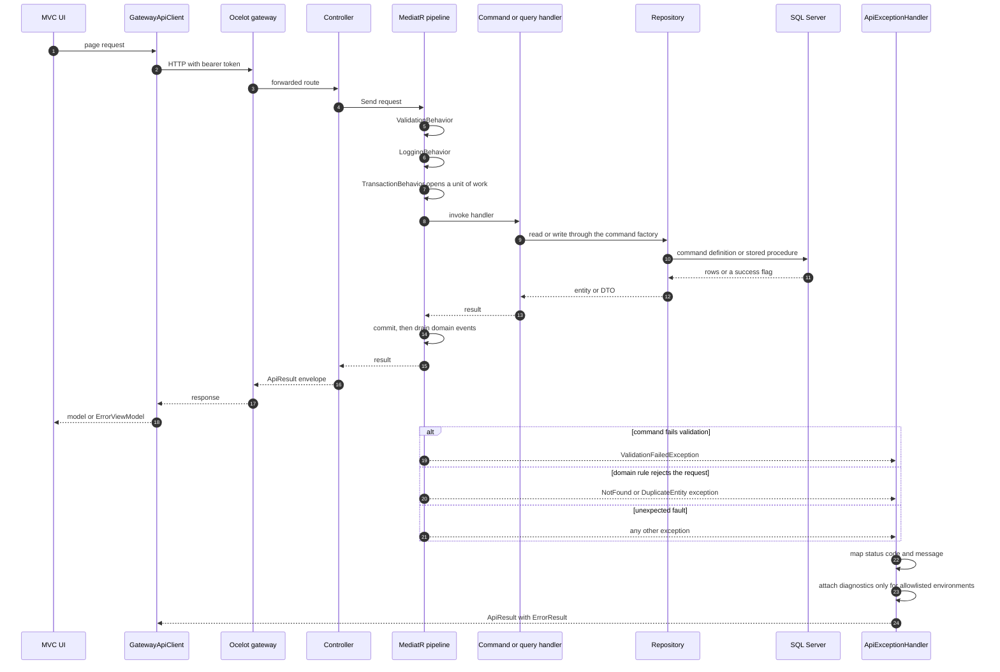

# API Reference

[Back to README](../README.md)

## API Documentation

Each microservice includes interactive Swagger documentation:

- **UserService**: `https://localhost:44344/swagger`
- **NotificationService**: `https://localhost:44314/swagger`

The documentation provides:

- Complete endpoint list
- Request/response schemas
- Interactive testing interface

## Request lifecycle

How a single call travels, and where a failure is converted into a response.



Three things worth reading off this diagram:

- **Validation runs before the transaction opens.** `ValidationBehavior` is registered first, so a
  rejected request never takes a database lock.
- **The controller never touches a repository.** It mediates only; that boundary is what makes the
  Application layer testable without a database.
- **Failures converge on one place.** `ApiExceptionHandler` is the single producer of the error
  envelope, and it is DI-constructed — see
  [Testing](testing.md#the-di-guard-and-why-it-eagerly-resolves) for why that is worth a test.

## API Surface

All endpoints are async-only. There is **no** `BaseApiController`: both service controllers derive from `ControllerBase` and rely on the `AuthorizationOptions.FallbackPolicy = RequireAuthenticatedUser()` set in each `Program.cs`, which is why every action is authenticated without carrying `[Authorize]`. `Register` and `Authenticate` carry `[AllowAnonymous]`; destructive actions carry `[Authorize(Policy = "Service")]`. `/health` is anonymous because it is not a controller action. The following endpoints are exposed beyond standard CRUD:

| Endpoint                                   | Method      | Description                                                      |
| ------------------------------------------ | ----------- | ---------------------------------------------------------------- |
| `/api/Users/Register`                      | POST        | Register a new user — `AllowAnonymous`                           |
| `/api/Users/Authenticate`                  | POST        | Authenticate and receive JWT — `AllowAnonymous`                  |
| `/api/Notifications/Send`                  | POST        | Send notifications to users; idempotent, see the note below      |
| `/api/NotificationHistories/{key1}/{key2}` | GET, DELETE | Composite-key lookup/delete (`DELETE` is `Service`-only)         |
| `/health`                                  | GET         | Liveness probe (anonymous; used by Docker Compose health checks) |

**`/api/Notifications/Send` has no failure branch of its own.** `SendNotificationsCommand` is a void MediatR request: the handler either completes or throws, so a successful call is `200 { success: true, data: true }` and every failure is produced by `ApiExceptionHandler` — `404` for an unknown `NotificationId`, `400` for validation, `500` otherwise. It is also **safe to retry**: the history insert filters against the composite key, so sending the same `(NotificationId, UserId)` pair twice is a no-op rather than a PK violation.

**Error Contract note:** error responses use real HTTP status codes — `400` for bad input (e.g. duplicate username on Register), `401` for unauthenticated access. The JSON body shape (`success: false` + `ErrorResult`) is unchanged for clients that inspect `success`.

## Error Contract

All API errors return a standardized `ErrorResult` object:

```json
{
  "success": false,
  "error": {
    "code": 404,
    "message": "User with ID 999 was not found.",
    "stackTrace": null,
    "innerMessage": null,
    "innerStackTrace": null
  }
}
```

Defined in `Shared/Shared.Api/ErrorResult.cs`.

**When diagnostic fields are populated.** `stackTrace`, `innerMessage` and `innerStackTrace` are
filled **only** when `environmentName` is one of `Development`, `Local`, `Test`
(case-insensitive). Everything else redacts — including `null`, `""`, `"   "`, a misspelling such as
`Prod`, and an environment nobody has added yet:

```csharp
// Shared/Shared.Api/ErrorResult.cs
private static readonly string[] DiagnosticEnvironments = ["Development", "Local", "Test"];

if (exception is not null
    && environmentName is not null
    && DiagnosticEnvironments.Contains(environmentName, StringComparer.OrdinalIgnoreCase))
{
    this.StackTrace = exception.StackTrace;
    // ...
}
```

This is an **allowlist**, not "not Production", and that is deliberate. The earlier form
(`!string.Equals(environmentName, "Production")`) is fail-**open**: a `null` name satisfied it, and
the `(int code, Exception ex, string? environmentName = null)` overload then made "forgot to pass
the environment" the _disclosing_ default. An allowlist makes the unsafe branch unreachable by
default, so introducing a new environment (e.g. `Staging`) is safe until someone deliberately adds
it here. `message` is always the client-safe text; only these three diagnostic fields vary.

Pinned by `ErrorResultTests` (allowlist membership, case-insensitivity, `null`, blank, and
near-miss names) and by `ApiExceptionHandlerTests.TryHandleAsync_WhenProduction_RedactsDiagnosticDetailFromResponse`.

## Security

Authentication uses JWT tokens with the following characteristics:

- **Algorithm**: HMAC-SHA256
- **Expiry**: 7 days
- **Password Hashing**: PBKDF2 (`Rfc2898DeriveBytes`, HMAC-SHA512, 600,000 iterations, 256-bit salt) with constant-time verification (`CryptographicOperations.FixedTimeEquals`) in `Services/UserService/UserService.Infrastructure/Services/PasswordHasher.cs`
- **Token Generation**: `JwtTokenService` in `Services/UserService/UserService.Infrastructure/Services/JwtTokenService.cs` (implements `ITokenService` from Domain)
- **Token Validation**: All endpoints are authenticated by default via `[Authorize]`. `Register`, `Authenticate`, and `/health` remain anonymous. JWT validation is wired in both `Services/UserService/UserService.Api/Program.cs` and `Services/NotificationService/NotificationService.Api/Program.cs`.
- **Shared Secret**: Both services must use the same `AppSettings:Secret` value. Inject one `JWT_SECRET` (see [.env.example](../.env.example)) — compose maps it into both services. Do not generate two keys.
- **Username Uniqueness**: A unique nonclustered index (`UXUsersUsername`) on `Users(Username)` enforces uniqueness at the database level, closing the check-then-act race on concurrent registration.
- **UI BFF**: The MVC UI never prompts for a user login. `Presentation/UI/Services/GatewayApiClient` (implementing `IGatewayApiClient`, registered as singleton) registers/authenticates a service account (`ApiSettings:ServiceUsername` / `ServicePassword`, compose: `UI_SERVICE_PASSWORD`) and attaches an HTTP Authorization Bearer header on every gateway call. The client caches the token with an expiry timestamp (thundering-herd-safe refresh via `SemaphoreSlim` double-check), refreshes on 401, and disposes its `SemaphoreSlim` on shutdown.
