# Architecture

[Back to README](../README.md)

## Overview

A modern, scalable notification system built with .NET 10 using a microservices architecture. This project demonstrates best practices in software design, including Clean Architecture, CQRS, DDD, and API gateway pattern implementation.

The application consists of multiple components:

- **Microservices**: UserService and NotificationService for handling business logic
- **API Gateway**: Centralized routing using Ocelot
- **Web UI**: MVC application with responsive design
- **Shared Kernel**: Shared.Api, Shared.Domain, Shared.Application, Shared.Infrastructure
- **Architecture Tests**: ArchUnitNET-based dependency rule enforcement

## Key Features

- **Notification Management**: Create, send, and track notifications
- **User Management**: User registration and profile management
- **Microservices Architecture**: Independent, scalable services
- **API Gateway**: Centralized request routing and management
- **API Documentation**: Interactive Swagger UI for all services
- **Responsive UI**: Modern web interface using Bootstrap and jQuery
- **Database**: SQL Server with Dapper ORM — LocalDB for local dev, SQL Server 2022 container in Docker
- **CORS Support**: Cross-origin resource sharing enabled
- **JWT Authentication**: HMAC-SHA256 token-based auth with 7-day expiry, validated by `JwtBearer` in both services. See [Security](api-reference.md#security).
- **Authorization**: authenticated by default via `AuthorizationOptions.FallbackPolicy = RequireAuthenticatedUser()` in each `Program.cs` (there is no `BaseApiController`) - every action is authenticated unless it carries `[AllowAnonymous]` (`Register`, `Authenticate`) or `[Authorize(Policy = "Service")]` (`DELETE`)
- **Docker Containerization**: Multi-stage alpine images, non-root execution, health checks, and app-level schema migration via `IHostedService`

## Architecture Diagram

```mermaid
flowchart TD

subgraph group_clients["Client Experience"]
  node_ui_web["MVC Web UI<br/>HomeController"]
  node_ui_api["UI API Facade<br/>ApiController"]
  node_gateway_client["GatewayApiClient<br/>caches a service-account token"]
end

subgraph group_edge["Gateway Edge"]
  node_gateway["Ocelot API Gateway<br/>routes by prefix"]
end

subgraph group_user_api["UserService.Api"]
  node_user_api["UsersController"]
  node_user_handler["ApiExceptionHandler<br/>produces ApiResult"]
end

subgraph group_user_app["UserService.Application"]
  node_user_cmd["RegisterUserCommand<br/>AuthenticateUserCommand"]
  node_user_query["GetUserByIdQuery<br/>GetAllUsersQuery"]
end

subgraph group_user_infra["UserService.Infrastructure"]
  node_user_repo["UserRepository<br/>Dapper, private UserRow"]
  node_user_uow["UnitOfWork"]
  node_user_jwt["JwtTokenService"]
  node_user_pwd["PasswordHasher"]
  node_user_consumer["UserRegisteredEventConsumer"]
end

subgraph group_user_domain["UserService.Domain"]
  node_user_entity["User aggregate<br/>Password value object"]
  node_user_event["UserRegisteredEvent"]
end

subgraph group_notif_api["NotificationService.Api"]
  node_notif_api["NotificationsController"]
  node_history_api["NotificationHistoryController"]
  node_notif_handler["ApiExceptionHandler<br/>produces ApiResult"]
end

subgraph group_notif_app["NotificationService.Application"]
  node_notif_cmd["SendNotificationsCommand"]
  node_notif_query["GetNotificationByIdQuery<br/>GetAllNotificationsQuery"]
end

subgraph group_notif_infra["NotificationService.Infrastructure"]
  node_notif_repo["NotificationRepository<br/>Dapper, private NotificationRow"]
  node_history_repo["NotificationHistoryRepository<br/>TVP + stored procedure"]
  node_notif_uow["UnitOfWork"]
end

subgraph group_notif_domain["NotificationService.Domain"]
  node_notif_entity["Notification aggregate<br/>NotificationStatus value object"]
  node_notif_event["NotificationSentEvent"]
end

subgraph group_shared["Shared Kernel"]
  node_shared_domain["Shared.Domain<br/>DomainEvent, DomainEventCollector"]
  node_shared_app["Shared.Application<br/>IRequest, pipeline behaviors"]
  node_shared_infra["Shared.Infrastructure<br/>MassTransitDomainEventDispatcher<br/>NullDomainEventDispatcher<br/>SqlCommands"]
  node_common["Shared.Api<br/>ApiResult, ErrorResult"]
end

node_user_actor(("End user"))
node_userdb[("UserDB<br/>Users")]
node_notifdb[("NotificationDB<br/>Notifications<br/>NotificationHistories")]
node_rabbitmq[("RabbitMQ<br/>needs a licence key")]

node_user_actor -->|"browses"| node_ui_web
node_ui_web -->|"submits"| node_ui_api
node_ui_api -->|"calls"| node_gateway_client
node_gateway_client -->|"HTTP with bearer token"| node_gateway
node_gateway -->|"api/Users"| node_user_api
node_gateway -->|"api/Notifications"| node_notif_api
node_gateway -->|"api/NotificationHistory"| node_history_api

node_user_api -->|"mediates"| node_user_cmd
node_user_api -->|"mediates"| node_user_query
node_user_cmd -->|"persists via"| node_user_repo
node_user_cmd -->|"signs with"| node_user_jwt
node_user_cmd -->|"hashes with"| node_user_pwd
node_user_query -->|"reads via"| node_user_repo
node_user_repo -->|"uses"| node_user_uow
node_user_repo -->|"queries"| node_userdb
node_user_cmd -->|"raises"| node_user_event
node_user_event -->|"consumed by"| node_user_consumer

node_notif_api -->|"mediates"| node_notif_cmd
node_notif_api -->|"mediates"| node_notif_query
node_history_api -->|"mediates"| node_notif_query
node_notif_cmd -->|"persists via"| node_notif_repo
node_notif_cmd -->|"streams TVP to"| node_history_repo
node_notif_query -->|"reads via"| node_notif_repo
node_notif_repo -->|"uses"| node_notif_uow
node_history_repo -->|"uses"| node_notif_uow
node_notif_repo -->|"queries"| node_notifdb
node_history_repo -->|"inserts into"| node_notifdb
node_notif_cmd -->|"raises"| node_notif_event

node_user_handler -.->|"shapes the response of"| node_common
node_notif_handler -.->|"shapes the response of"| node_common
node_user_cmd -->|"pipeline from"| node_shared_app
node_notif_cmd -->|"pipeline from"| node_shared_app
node_shared_infra -->|"publishes after commit"| node_rabbitmq
node_shared_app -->|"selects dispatcher"| node_shared_infra

classDef toneNeutral fill:#f8fafc,stroke:#334155,stroke-width:1.5px,color:#0f172a
classDef toneBlue fill:#dbeafe,stroke:#2563eb,stroke-width:1.5px,color:#172554
classDef toneAmber fill:#fef3c7,stroke:#d97706,stroke-width:1.5px,color:#78350f
classDef toneMint fill:#dcfce7,stroke:#16a34a,stroke-width:1.5px,color:#14532d
classDef toneRose fill:#ffe4e6,stroke:#e11d48,stroke-width:1.5px,color:#881337
classDef toneIndigo fill:#e0e7ff,stroke:#4f46e5,stroke-width:1.5px,color:#312e81
classDef toneTeal fill:#ccfbf1,stroke:#0f766e,stroke-width:1.5px,color:#134e4a
class node_ui_web,node_ui_api,node_gateway_client,node_user_actor toneBlue
class node_gateway,node_userdb,node_notifdb,node_rabbitmq toneAmber
class node_user_api,node_user_handler,node_user_cmd,node_user_query toneMint
class node_notif_api,node_notif_handler,node_notif_cmd,node_notif_query toneRose
class group_user_infra,node_user_repo,node_user_uow,node_user_jwt,node_user_pwd,node_user_consumer toneTeal
class group_notif_infra,node_notif_repo,node_history_repo,node_notif_uow toneTeal
class group_user_domain,node_user_entity,node_user_event toneIndigo
class group_notif_domain,node_notif_entity,node_notif_event toneIndigo
class group_shared,node_shared_domain,node_shared_app,node_shared_infra,node_common toneNeutral
```



Dependency direction is inward and is enforced, not merely documented — see
[Conventions](conventions.md) for the rules and how `ArchitectureTests` proves them.

## Tech Stack

| Layer                  | Technology                                                                                                                                                                                |
| ---------------------- | ----------------------------------------------------------------------------------------------------------------------------------------------------------------------------------------- |
| **Framework**          | ASP.NET Core 10 (net10.0)                                                                                                                                                                 |
| **Architecture**       | Clean Architecture + CQRS + DDD, Microservices                                                                                                                                            |
| **Languages**          | C#                                                                                                                                                                                        |
| **Database**           | SQL Server 2022 (Docker) / LocalDB + Dapper                                                                                                                                               |
| **API Gateway**        | Ocelot 25.0.1                                                                                                                                                                             |
| **Container**          | Docker (multi-stage alpine, non-root, health checks)                                                                                                                                      |
| **Frontend**           | ASP.NET Core MVC (Bootstrap, jQuery, Grid.js)                                                                                                                                             |
| **API Documentation**  | Swagger/OpenAPI                                                                                                                                                                           |
| **HTTP Client**        | RestSharp                                                                                                                                                                                 |
| **Messaging**          | MassTransit 8.5.10 (in-memory / RabbitMQ), post-commit domain event dispatch — permissively licensed, no key required (see [Messaging & Dispatch](messaging.md#publish-on-the-runtime-type)) |
| **Validation**         | FluentValidation                                                                                                                                                                          |
| **Architecture Tests** | ArchUnitNET (TUnit adapter)                                                                                                                                                               |

## Project Structure

```
├── Shared/
│   ├── Shared.Api/                  # ApiResult, ErrorResult, ApiExceptionHandler, MessagingHealthCheck
│   ├── Shared.Domain/               # DomainEvent, IDomainEventDispatcher, DomainEventCollector
│   ├── Shared.Application/          # IRequest markers, CommonBehavior pipeline, AppSettings (Shared.Helpers)
│   └── Shared.Infrastructure/       # MassTransitDomainEventDispatcher, NullDomainEventDispatcher, UnitOfWork, DatabaseMigrationBase, DapperConfiguration, Persistence/SqlCommands
├── Services/
│   ├── UserService/
│   │   ├── UserService.Domain/          # User entity, Password VO, UserRegisteredEvent, repository interfaces
│   │   ├── UserService.Application/     # CQRS commands/queries, DTOs, FluentValidation, behaviors
│   │   ├── UserService.Infrastructure/  # Dapper repositories (execute only), Persistence/*CommandFactory, UnitOfWork, JwtTokenService, PasswordHasher, MassTransit
│   │   └── UserService.Api/             # Controllers, Program.cs, JWT auth
│   ├── NotificationService/
│   │   ├── NotificationService.Domain/          # Notification entity, NotificationStatus VO, NotificationSentEvent
│   │   ├── NotificationService.Application/     # CQRS commands/queries, DTOs, FluentValidation, behaviors
│   │   ├── NotificationService.Infrastructure/  # Dapper repositories (execute only), Persistence/*CommandFactory, TVP, UnitOfWork, MassTransit publisher
│   │   └── NotificationService.Api/             # Controllers, Program.cs, JWT auth
│   └── ApiGateway/                      # Ocelot API Gateway
├── Presentation/
│   └── UI/                              # ASP.NET Core 10 MVC (Bootstrap/jQuery/Grid.js)
│       └── Services/                    # GatewayApiClient, IGatewayApiClient - BFF pattern
└── Tests/
    ├── ArchitectureTests/             # ArchUnitNET dependency rule tests (TUnit adapter)
    ├── IntegrationTests/              # Real-broker guard: domain-event routing via the production dispatcher (RabbitMQ, not self-contained)
    ├── WiringTests/                   # DI resolution + stored-procedure contract guards (TUnit; scans production source)
    └── UnitTests/
        ├── UserService.Tests/         # User command/query/handler/validator, domain, infrastructure, API controller tests
        ├── NotificationService.Tests/ # Notification command/query/handler/validator, domain, infrastructure, API controller tests
        ├── Shared.Tests/              # ApiResult, ErrorResult redaction, ApiExceptionHandler, MessagingHealthCheck, pipeline behaviors, UnitOfWork, DomainEventCollector, SqlCommands
        ├── UI.Tests/                  # Controllers, GatewayApiClient token lifecycle, Startup DI, ErrorViewModel
        └── TestDoubles/               # Mocks/ (repos, UoW, mediator, security, gateway client) + Stubs/ (InMemoryUserRepository, SyncHasher, TestDomainEvent) + Helpers/ (SqlException, TestHostEnvironment, HttpContext, CommandParameterNames, fixtures)
```

## Domain Entities

| Entity       | Location                                                                           | Key Fields                              |
| ------------ | ---------------------------------------------------------------------------------- | --------------------------------------- |
| User         | `Services/UserService/UserService.Domain/Entities/User.cs`                         | Id, Username, Password (VO), CreatedAt  |
| Notification | `Services/NotificationService/NotificationService.Domain/Entities/Notification.cs` | Id, Title, Content, Status (VO), SentAt |

**`NotificationHistory` is not a domain entity.** It lives at
`Services/NotificationService/NotificationService.Domain/NotificationHistory.cs` — inside the Domain
_project_, but deliberately **not** a domain entity (no behavior) and **not** a value object (it has
composite identity, `NotificationId` + `UserId`). It is an infrastructure-level DTO for the
`NotificationHistories` join table, kept next to the domain only because both share its composite
key. Do not add domain rules to it, and do not treat its `Domain` folder location as a signal that
it belongs to the domain model.

##

Clean Architecture + CQRS + DDD with the following layers per service:

1. **Domain**: Rich entities with behavior (`User.Create()`, `Notification.MarkAsSent()`), value objects (`Password`, `NotificationStatus`), domain events (`UserRegisteredEvent`, `NotificationSentEvent`), repository interfaces (`IUserRepository`, `INotificationRepository`), `IUnitOfWork`, `IDomainEventDispatcher`. No Dapper/EF attributes.
2. **Application**: CQRS commands/queries via MediatR (`IRequest<T>`), DTOs, FluentValidation, pipeline behaviors (validation, logging, transaction). `ICommand` marker for write operations.
3. **Infrastructure**: Dapper repositories that only _execute_ — their `CommandDefinition`s are built in `Persistence/*CommandFactory.cs`, with cross-service SQL shapes in `Shared.Infrastructure/Persistence/SqlCommands.cs`. Plus `UnitOfWork`, `JwtTokenService`, `PasswordHasher`, MassTransit event publisher, TVP definitions.
4. **Api**: Controllers delegate to `IMediator`, JWT auth, `ApiResult<T>` response wrapper.

**Shared Kernel** (`Shared/`): `DomainEvent`, `IRequest` markers, `IDomainEventDispatcher`, `MassTransitDomainEventDispatcher`, `DomainEventCollector` (AsyncLocal, seeded by the transaction pipeline), `SqlCommands` (shared SQL shapes + identifier validation), `CommonBehavior` pipeline, `AppSettings` (`Shared.Helpers` namespace).

**Messaging**: Domain events dispatched via `IDomainEventDispatcher` **after** the ambient transaction commits (post-commit dispatch — see [Messaging & Dispatch](messaging.md#publish-on-the-runtime-type)). In-memory transport for local dev, RabbitMQ for Docker/production. Toggle via `Messaging:UseRabbitMq` (`Messaging__UseRabbitMq` as env var); compose injects `Messaging__UseRabbitMq=true` + `Messaging__RabbitMq__Host=rabbitmq`.

**Stored Procedures**: Write operations use SPs (`SPRegisterUser`, `SPAuthenticateUser`, `SPInsertNotification`, `SPUpdateNotification`, `SPNotificationHistoryInsert`). Reads use Dapper `QueryAsync`. SP invocations stay in each service's own `*CommandFactory` because their parameter shapes differ per domain; only the projection and soft-delete shapes are shared.

**Architecture Tests**: ArchUnitNET (via the `TngTech.ArchUnitNET.TUnit` adapter) enforces dependency direction rules. Run: `dotnet test Tests/ArchitectureTests/ArchitectureTests.csproj -c Debug`.

**Unit Tests**: The full suite (UserService, NotificationService, Shared, UI, Wiring, Architecture) plus the broker-backed integration guard requires a running RabbitMQ — see [Testing](testing.md#broker-backed-coverage). Run:

```bash
dotnet test NotificationSystem.slnx -c Release
```

Per-project counts, measured 2026-09-29 from the TUnit reports: `Shared.Tests` 96 · `UserService.Tests` 101 · `NotificationService.Tests` 115 · `UI.Tests` 38 · `WiringTests` 25 · `ArchitectureTests` 15 · `IntegrationTests` 2 = **392**, `failed: 0`. The solution total includes `ArchitectureTests`, which **is** discovered and passes under `-c Release` (only Debug is a _meaningful_ run, since ArchUnitNET analyses IL). The run reports `error: 1` and exits `8` even when all pass, because `TestDoubles` is a class library with no tests and `global.json`'s `test` node cannot exclude it - **gate on `failed: 0`**. Re-measure before quoting a number.

Coverage is collected per test project with the MTP `--coverage` flag — see [Testing](testing.md#testing).

## Cross-cutting Concerns

- **CORS**: Pinned to the UI origin via `WithOrigins()` in each service (was `AllowAnyOrigin` — tightened to prevent direct cross-service access). The UI is a same-origin server-side proxy; browser clients never call the services directly.
- **Error Contract**: `ErrorResult` populates `StackTrace`/`InnerMessage`/`InnerStackTrace` only in the allowlisted environments `Development`, `Local`, `Test`. Everything else — including `null`, blank, and unrecognised names — redacts. See [Error Contract](api-reference.md#error-contract).
- **MediatR Pipeline**: `ValidationBehavior` (FluentValidation), `LoggingBehavior`, and `TransactionBehavior` (wraps `ICommand` handlers in `UnitOfWork` transactions)
