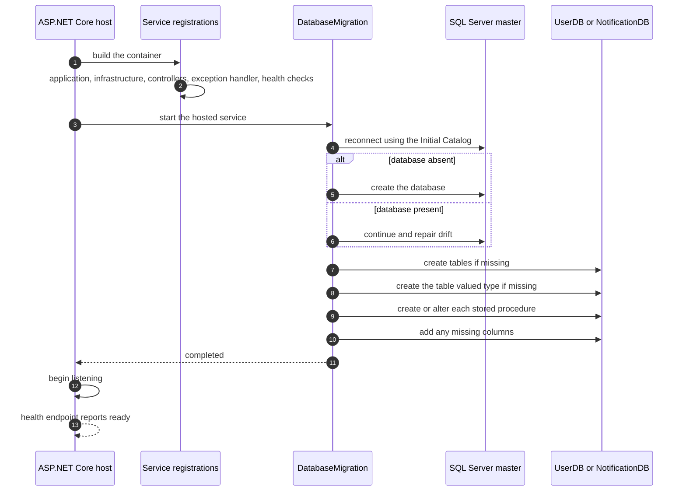

# Getting Started

[Back to README](../README.md)

## What happens on start-up

Schema creation is not a manual step and not a migration tool. It is a hosted service that runs
before the app serves traffic, and it is idempotent, so a restart against a drifted database repairs
it rather than failing.



Two details that save real debugging time:

- **The connection string must name a catalog.** `DatabaseMigrationBase` reconnects to `master`
  first; an empty catalog produces `CREATE DATABASE []` and nothing more useful.
- **`create_host_path: false` in compose is deliberate.** Docker will not silently create a host
  directory for a bind mount, so a missing secrets file fails loudly instead of producing an empty
  file that then fails later, further away.

## Prerequisites

- [.NET 10 SDK](https://dotnet.microsoft.com/download/dotnet/10.0)
- Visual Studio or Visual Studio Code
- SQL Server LocalDB (included with Visual Studio) for running services locally, or Docker Desktop for the full containerized stack (SQL Server 2022 + all four services)

## Installation

1. Clone the repository:

   ```bash
   git clone https://github.com/ahmadmdabit/NotificationSystem.git
   cd NotificationSystem
   ```

2. Build the solution:
   ```bash
   dotnet build NotificationSystem.slnx
   ```

## Generating a Development Secret

The JWT signing secret is not stored in source control. Each developer must generate a local secret before first run.

**Option 1: User Secrets (recommended for development)**

```bash
# Same value in both services — they share one signing key
SECRET=$(openssl rand -hex 64)
(cd Services/UserService/UserService.Api && dotnet user-secrets init && dotnet user-secrets set "AppSettings:Secret" "$SECRET")
(cd Services/NotificationService/NotificationService.Api && dotnet user-secrets init && dotnet user-secrets set "AppSettings:Secret" "$SECRET")
(cd Presentation/UI && dotnet user-secrets init && dotnet user-secrets set "ApiSettings:ServicePassword" "$(openssl rand -hex 16)")
```

**Option 2: Environment variables**

```bash
# PowerShell
$env:AppSettings__Secret = "$(openssl rand -hex 64)"

# bash
export AppSettings__Secret="$(openssl rand -hex 64)"
```

**Option 3: appsettings.Development.json (gitignored by default)**

Create `Services/UserService/UserService.Api/appsettings.Development.json`:

```json
{
  "AppSettings": {
    "Secret": "<64-char-hex-string>",
    "SqlConnectionString": "..."
  }
}
```

**Production:** Inject via environment variable or secret vault (Azure Key Vault, etc.). Never commit secrets.

**Verification:** After setting the secret, `dotnet run --environment Development` on UserService should not throw on `AppSettings.Secret`.

## Running the Application

**Option 1: Local development (no Docker)**

1. Generate and set the shared JWT signing secret plus the UI BFF password:

   ```bash
   export JWT_SECRET=$(openssl rand -hex 64)
   export AppSettings__Secret=$JWT_SECRET
   export ApiSettings__ServicePassword=$(openssl rand -hex 16)
   export SQL_SA_PASSWORD=ChangeMe@123!
   ```

   Or use User Secrets per project (see [Generating a Development Secret](#generating-a-development-secret)).

2. Start the microservices in separate terminals:
   ```bash
   cd Services/UserService/UserService.Api && dotnet run
   cd Services/NotificationService/NotificationService.Api && dotnet run
   cd Services/ApiGateway && dotnet run
   cd Presentation/UI && dotnet run
   ```

**Option 2: Docker Compose (recommended)**

1. Ensure Docker is available (this project assumes Docker inside WSL2 Ubuntu — `wsl -d ubuntu -- docker` if it is not on your Windows `PATH`). Generate `.env` from `.env.example` and set secrets:

   ```bash
   cp .env.example .env
   # Edit .env and set ALL of these — any empty one stops the stack from starting:
   #   SQL_SA_PASSWORD
   #   JWT_SECRET
   #   UI_SERVICE_PASSWORD
   #   RABBITMQ_USER        # non-default: RabbitMQ refuses remote logins for 'guest'
   #   RABBITMQ_PASSWORD
   python3 -c "import secrets; print(secrets.token_hex(32))"
   ```

   > ⚠️ **`RABBITMQ_USER` / `RABBITMQ_PASSWORD` are the most commonly missed step.** Compose
   > declares both as required, so an empty value fails _interpolation_ before a single container
   > starts — the error names the missing variable rather than anything about your code. They must
   > be non-`guest`: RabbitMQ's `guest` account is loopback-only and is refused over the compose
   > bridge network.

2. **No MassTransit licence needed.** `MassTransit` is pinned at 8.5.10, which is permissively
   licensed and creates a bus with no key. An earlier revision pinned the commercially
   licensed 9.2.2 and required a key file on disk — that apparatus has been removed, so there is
   no file to create before the first `up`. See
   [Messaging & Dispatch](messaging.md#licence-requirement--historical-masstransit-9x-only).
   To start with messaging off instead, set `MESSAGING_ENABLED=false` — note that is the
   **compose** variable, and a `Messaging__Enabled` line in `.env` is ignored. Events are dropped,
   not queued, so it is a local-dev convenience rather than a deployment mode.

3. Start the full stack:

   ```bash
   docker compose up -d --build
   ```

4. Check health:
   ```bash
   docker compose ps  # all services should report (healthy)
   ```

**Option 3: Development watch**

```bash
cd Services/UserService/UserService.Api && dotnet watch run
cd Services/NotificationService/NotificationService.Api && dotnet watch run
cd Services/ApiGateway && dotnet watch run
cd Presentation/UI && dotnet watch run
```

## Service Ports

| Service             | Host (Compose)                            | URL (local dev, `dotnet run`) |
| ------------------- | ----------------------------------------- | ----------------------------- |
| UserService         | `http://localhost:8081/api/Users`         | `https://localhost:44344`     |
| NotificationService | `http://localhost:8081/api/Notifications` | `https://localhost:44314`     |
| ApiGateway          | `http://localhost:8081`                   | `https://localhost:5001`      |
| UI                  | `http://localhost:8080`                   | `https://localhost:5001` ⚠️   |
| SQL Server          | (not published — internal only)           | n/a                           |

Ports come from each project's `Properties/launchSettings.json`, not from this table — that file is
the source of truth. Two things to know before running everything locally:

- ⚠️ **`ApiGateway` and `UI` both bind `https://localhost:5001` / `http://localhost:5000`.** Running
  both with `dotnet run` at the same time will fail with an address-in-use error. Override one of
  them, e.g. `dotnet run --urls https://localhost:5002;http://localhost:5003`.
- ⚠️ **`UI`'s `ApiSettings:GatewayBaseUrl` is `https://localhost:44315`** (`Presentation/UI/appsettings.json`),
  but `ApiGateway`'s launch profile binds `5001`. The UI cannot reach the gateway until one of the
  two is changed. This is a pre-existing local-dev mismatch, not a Docker-path problem — in Compose
  the UI calls `http://apigateway:8080` and is unaffected.
