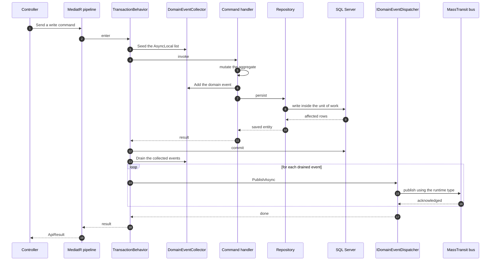

# Messaging & Dispatch

[Back to README](../README.md)

## Dispatch: after commit, on the runtime type

Every write command goes through one pipeline behaviour that opens a transaction, invokes the
handler, commits, and *only then* publishes. The ordering is the guarantee.



Three failure modes this shape exists to prevent:

- **Ghost events on rollback.** A publish before commit would announce a write that never happened.
  The `Drain` is unreachable unless the commit returned.
- **Silently dropped events.** `AsyncLocal` flows *into* an awaited callee but a mutation made
  inside it does not flow back out, so the handler's `Add` would land on a list the pipeline cannot
  see. `Seed()` in the pipeline's own execution context is what prevents that, and
  `TransactionBehaviorTests` is the regression guard.
- **Publish under the wrong exchange.** The broker derives the exchange from the *static* generic
  argument, so `PublishAsync<T>` over a `List<DomainEvent>` would send everything to the base-type
  exchange that has no bound queue. Casting to `object` selects the runtime type.

## Licence history

> **MassTransit is pinned to 8.5.10, which is permissively licensed and needs no key.** An earlier
> revision pinned 9.2.2, which is commercially licensed and refused to create a bus without one; that
> gate applied to every transport including in-memory, and was the single most common reason
> `docker compose up` could not reach `healthy`. Both services were downgraded to 8.5.10 and the
> licence apparatus was removed. This section is retained as history, because the failure mode is
> worth recognising if the pin is ever raised.

### Licence requirement — historical (MassTransit 9.x only)

> Applies to **9.x only**. Not to the current 8.5.10 pin.

Both `.Infrastructure.csproj` files pinned `MassTransit` / `MassTransit.RabbitMQ` at **9.2.2**. The
licence gate runs **when the bus is created, before the transport is chosen**, so it applied to the
in-memory transport too:

```
Unhandled exception. MassTransit.ConfigurationException: The bus configuration is invalid:
   [Failure] License must be specified with SetLicense/SetLicenseLocation or by
   setting the MT_LICENSE/MT_LICENSE_PATH environment variables.
```

There was **no development, CI, test or evaluation exemption** — not one environment was exempt.
Setting `Messaging__UseRabbitMq=false` did **not** avoid it.

The key was read from a file bind-mounted read-only at `~/.dotnet/MassTransit/license.txt`, with the
path overridable via `MASSTRANSIT_LICENSE_FILE`. It was never placed in a `Dockerfile`, `ARG`,
`ENV`, `appsettings`, or any committed file.

Two details worth keeping, because both produced confusing symptoms:

- The bind mount was **unconditional**, so the file had to exist before the first
  `docker compose up` even with messaging disabled:
  ```bash
  mkdir -p ~/.dotnet/MassTransit && touch ~/.dotnet/MassTransit/license.txt
  ```
  `create_host_path: false` turned a missing source path into a clear error, which is why the short
  bind syntax was rejected — it silently creates a *directory* there, and that then broke the mount
  with an opaque failure instead of the documented "License must be specified".
- A missing key and a *malformed* key fail differently, and the difference is how you confirm the
  path is being read: `License must be specified` means the path was **not** resolved;
  `The license could not be loaded: The input is not a valid Base-64 string…` means the path **was**
  read and the contents are invalid. Verified against a running container 2026-09-28.

**Current state:** 8.5.10 requires none of this. `MT_LICENSE_PATH`, the bind mount, and
`MASSTRANSIT_LICENSE_FILE` are all removed from `docker-compose.yml`, and there is no prerequisite
file to create before the first `up`.

### Publish on the runtime type

`MassTransitDomainEventDispatcher.PublishAsync<T>` casts to `object` before publishing. This is

load-bearing, not a style choice.

MassTransit derives the publish exchange from the **static** generic argument of `Publish<T>`,
not from `message.GetType()`. `TransactionBehavior` drains a `List<DomainEvent>`, so `T` infers
as the abstract base type and every event is published to `Shared.Domain:DomainEvent` -- an
exchange with no bound queue. RabbitMQ accepts the message and discards it: no exception,
HTTP 200, empty queue, silent consumer. Writes still commit.

Casting to `object` selects the non-generic `IPublishEndpoint.Publish(object, CancellationToken)`
overload, which resolves `message.GetType()` and re-enters the generic publish with `T` = the
concrete event type, landing on the exchange the consumer actually binds to.

Verified against a live broker on 8.5.10, and by reading the implementation:

```
PublishEndpoint.Publish(object)              -> Type type = message.GetType();
PublishEndpointConverterCache.Publish(...)  -> Cached.Converters.Value[type].Publish(...)
PublishEndpointConverter<T>.Publish(...)   -> endpoint.Publish(message2, ct)   // generic, T = runtime
```

**Do not "simplify" that cast away.** Removing it restores the silent discard, and no unit test or
in-memory-transport test can catch it: a mocked `IPublishEndpoint` cannot observe exchange
naming, and the in-memory transport never reaches naming logic. Only a real broker
distinguishes "the consumer received it" from "the message went somewhere unbound". That suite now
exists -- see [Development](testing.md#broker-backed-coverage). It is mutation-verified: removing this cast
turns it red.


⚠️ `MessageTypeCache.GetMessageTypes()` also yields **base** types, so a `DomainEvent` publish
exchange is declared and bound to the concrete one. That means the base exchange legitimately
accumulates `publish_in` even when routing is correct -- so `publish_in` is not a usable
regression signal. Assert on the concrete exchange and on bound-queue topology instead.

### Messaging on/off

`Messaging:Enabled` (`Messaging__Enabled` as an env var, `MESSAGING_ENABLED` in compose) switches the
whole bus registration:

> ⚠️ **The two names are not interchangeable, and `.env` needs the second one.**
> `docker-compose.yml` sets `Messaging__Enabled=${MESSAGING_ENABLED:-true}` as an explicit
> container environment entry, so it **overwrites** whatever `.env` holds under that name.
> Use `MESSAGING_ENABLED=false` in `.env` for compose; use `Messaging__Enabled=false` only when you
> `dotnet run` an API directly and have it exported. Setting only `Messaging__Enabled` in
> `.env` leaves messaging **on** in the containers, and you get the licence crash-loop below.

| Value                        | Behaviour                                                                                                                                                                                               |
| ---------------------------- | ------------------------------------------------------------------------------------------------------------------------------------------------------------------------------------------------------- |
| `true` (default)             | Bus is registered. No licence key required (8.5.10).                                                                                                                                                    |
| absent, `""`, or unparseable | Treated as `true` — an absent key never silently disables the broker.                                                                                                                                   |
| `false`                      | **No MassTransit registration at all.** `NullDomainEventDispatcher` is registered instead. Services start, `/health` answers, domain events are **dropped** and logged at Debug. Not a deployment mode — the events are lost. |

```bash
# run with no bus at all (local dev only)
MESSAGING_ENABLED=false docker compose up -d
```

`NullDomainEventDispatcher` is not optional decoration. Without a bus there is no `IPublishEndpoint`,
so `MassTransitDomainEventDispatcher` would be unresolvable and the **post-commit dispatch path in
`TransactionBehavior` would fail** — losing events is a far better failure than a dead pipeline.
`MessagingHealthCheck` reports messaging as disabled rather than probing a broker that is not there,
so a stopped bus is visible in `/health` instead of silently healthy.

> **Not a deployment mode.** With messaging off, events are discarded, not queued. Keep it enabled in
> production.

### Transport

Selected by `Messaging:UseRabbitMq` (`Messaging__UseRabbitMq` as env var / `.env` key):

- **Local dev** (default): in-memory transport — no broker and no licence required.
  `Messaging:Enabled=false`).
- **Docker/production**: RabbitMQ transport, injected by `docker-compose.yml` via `Messaging__UseRabbitMq=true` + `Messaging__RabbitMq__Host=rabbitmq` + `Messaging__RabbitMq__Username`/`Password` for both services.

**Broker credentials** (`.env.example` → `.env`):

- `RABBITMQ_USER` / `RABBITMQ_PASSWORD` — compose maps these to RabbitMQ's `RABBITMQ_DEFAULT_USER`/`RABBITMQ_DEFAULT_PASS`. RabbitMQ's default `guest` account is loopback-only and **refused** for remote (bridge-network) connections, so a non-guest pair is required when `Messaging__UseRabbitMq=true`.
- RabbitMQ ports: `5672` (AMQP). Management UI is available on `15672` (not forwarded in compose).

**Post-commit dispatch** (no ghost events on rollback):

1. Aggregate domain events (`UserRegisteredEvent`, `NotificationSentEvent`) carry their payload and are raised during command-handler execution.
2. Handlers record events on `Shared.Domain.DomainEventCollector` — an `AsyncLocal<List<DomainEvent>>` that isolates concurrent async flows per-request.
3. `Shared.Application.Behaviors.TransactionBehavior<TRequest, TResponse>` wraps every `ICommand` in an `IUnitOfWork` transaction. **Before** invoking the handler it calls `DomainEventCollector.Seed()`. Only after `_unitOfWork.CommitAsync()` succeeds does it call `DomainEventCollector.Drain()` and publish each event via `MassTransitDomainEventDispatcher` (which wraps MassTransit's `IPublishEndpoint`).
4. On rollback, `DomainEventCollector.Clear()` discards pending events — they are never published.

> ⚠️ **`Seed()` is load-bearing.** `AsyncLocal` values flow _into_ an awaited callee, but a mutation made inside it does **not** flow back to the caller. Without seeding, the handler's `Add()` allocates a list the pipeline cannot see, the post-commit `Drain()` returns empty, and **every domain event is silently dropped** — writes commit, nothing is published. This was a live defect, fixed 2026-09-26. `TransactionBehaviorTests.Handle_HandlerAddsEventInsideNext_PublishesItPostCommit` guards it.

**Topology**:

- **`UserService`** **publishes** `UserRegisteredEvent` (after commit) and **consumes** it via `UserRegisteredEventConsumer` (registered with `cfg.AddConsumer<UserRegisteredEventConsumer>()` + `cfg.ConfigureEndpoints(context)`). The consumer's `Handle` method and `LogMessageTemplate` are `internal` — visible to `UserService.Tests` via `[assembly: InternalsVisibleTo("UserService.Tests")]` in `UserService.Infrastructure/Properties/AssemblyInfo.cs`, not on the public API surface. The attribute form is required because that project sets `GenerateAssemblyInfo=false`, which disables the `<InternalsVisibleTo Include="…"/>` item form used in `UI.csproj`.
- `NotificationService` **publishes** `NotificationSentEvent` (after commit). It has no consumer for this event — it is a pure publisher (notification history is written to SQL via `SPNotificationHistoryInsert` TVP, not consumed from the broker).

**Health**: `MessagingHealthCheck` (`Shared.Api`) has three outcomes:

- `Messaging:Enabled=false` → `Healthy` with "messaging is disabled; domain events are dropped".
- `Messaging:UseRabbitMq=false` → `Healthy` with "in-memory transport in use; no broker required".
- RabbitMQ active → TCP connect probe to `Messaging:RabbitMq:Host`:`Port` (default `localhost:5672`).

Registered as the `"messaging"` health check in both services' `Program.cs`.

**Verification status at the current 8.5.10 pin**

| Scenario | Status |
| --- | --- |
| `MESSAGING_ENABLED=false`, both services up, `/health` answers | Verified live (2026-09-28): both services `healthy` in ~10 s, `IDomainEventDispatcher` resolves to `NullDomainEventDispatcher`, events dropped rather than published |
| `MESSAGING_ENABLED=true` against a live RabbitMQ | **Not yet re-verified under 8.5.10.** The 9.2.2-era run proved only that `MT_LICENSE_PATH` was honoured, by watching the error change from `License must be specified` to a Base-64 parse error. Both rows are meaningless at 8.5.10, which needs no key |
| Health check reports messaging as disabled rather than probing a broker that is not there | Implemented; not exercised by an automated test |

If you raise the MassTransit pin above 8.5.10, the whole licence apparatus above becomes
mandatory again — and the first symptom is a container that will not start, not a failing test.
