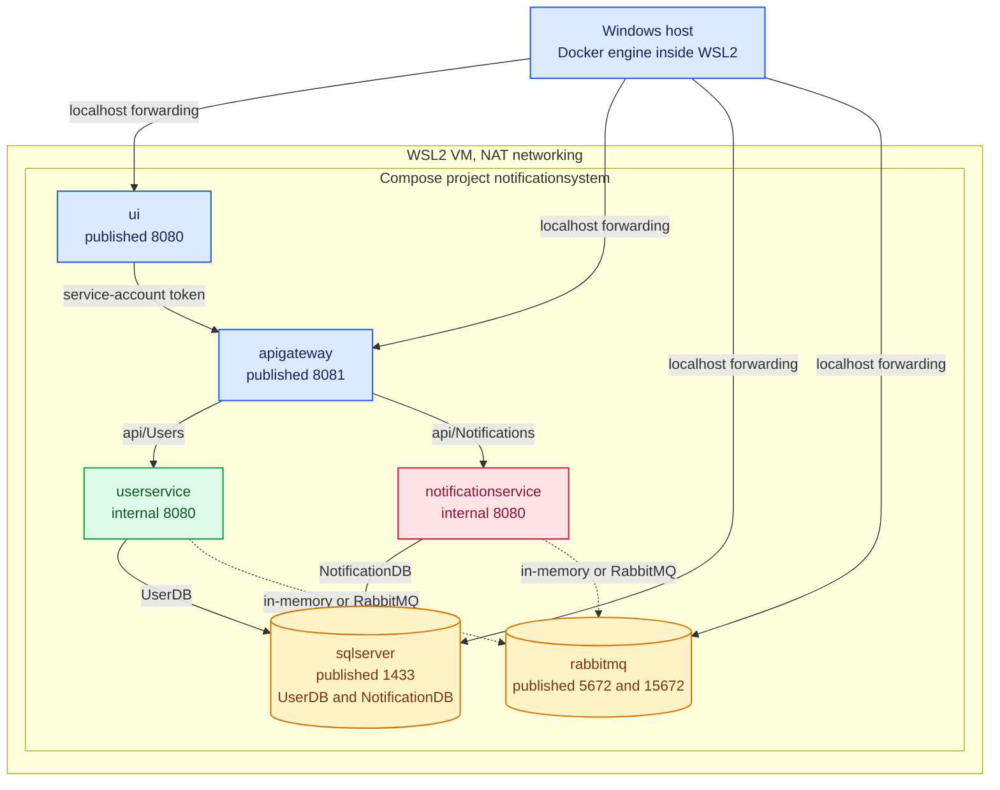

# Operations

[Back to README](../README.md)

## Runtime topology

The stack runs inside WSL2, not on the Windows host directly. That single fact explains most
"cannot reach it from Windows" reports, and it is where the two independent idle timers bite.



Two timers terminate this VM if nothing holds it open, and a short-lived
`wsl -d ubuntu -- docker ps` between commands is exactly what triggers them:

| Setting | Section | Default | Effect |
| --- | --- | --- | --- |
| `vmIdleTimeout` | `[wsl2]` | `60000` | VM shuts down after the last WSL process exits |
| `instanceIdleTimeout` | `[general]` | `15000` | The distro shuts down on the same idea |

For a development machine that keeps the broker alive between commands, set both in
`C:\Users\<you>\.wslconfig`:

```ini
[wsl2]
vmIdleTimeout=86400000
[general]
instanceIdleTimeout=-1
```

`localhostForwarding` is what makes the published ports reachable from Windows. It is **ignored**
under `networkingMode=mirrored`, so NAT is the correct mode for this stack.

> ⚠️ **A `healthy` container is not a serving service.** `docker ps` shows only running containers
> and `docker port` prints a mapping whether or not anything is bound. Confirm with
> `ss -ltn | grep <port>` before blaming the network. See
> [Green Instruments and Dead Services](learning/green-instruments-and-dead-services.md).

## Frontend Dependencies

- **RestSharp** (`114.0.0`): UI calls the API gateway via `GatewayApiClient` (`ApiSettings:GatewayBaseUrl`; Docker: `http://apigateway:8080`; local dev: `https://localhost:44315` in `UI/appsettings.json`). ⚠️ `44315` does **not** match `ApiGateway`'s launch profile, which binds `https://localhost:5001` — see the port table in [Running the Application](getting-started.md#running-the-application). Compose is unaffected.
- **Grid.js**: Loaded from CDN in `UI/Views/Home/Index.cshtml` for notification history display
- **Anti-forgery**: `[ValidateAntiForgeryToken]` on POST endpoints; token injected via `@inject Microsoft.AspNetCore.Antiforgery.IAntiforgery`

## CI/CD

The project includes a GitHub Actions workflow (`.github/workflows/docker-build.yml`) that builds and pushes all four service images to Docker Hub on every push to `master`:

- `ahmadmdabit/notificationsystem-userservice`
- `ahmadmdabit/notificationsystem-notificationservice`
- `ahmadmdabit/notificationsystem-apigateway`
- `ahmadmdabit/notificationsystem-ui`

Each image is tagged with `latest` and the commit SHA. Build caching uses GitHub Actions cache (`type=gha`).

## Docker Compose Test Environment

`docker-compose.test.yml` provides an isolated, fail-fast SQL Server **and a RabbitMQ broker** for integration tests. The broker is host-published on `5673`/`15673` (the main stack owns `5672`), because the tests run on the host rather than inside the Compose network. It uses `restart: "no"` and no named volume to ensure a clean state on every run, and declares its own Compose project name (`notificationsystem-test`) so a `down -v` scoped to it cannot remove the main stack's containers or volumes. App services are intentionally excluded - tests connect to these directly. `Tests/IntegrationTests` reads its broker credentials from this same `.env`, so a plain `dotnet test` needs no manual exporting.

```bash
docker compose -f docker-compose.test.yml up -d --wait rabbitmq   # broker for Tests/IntegrationTests
docker compose -f docker-compose.test.yml down -v                        # full reset
```

> ⚠️ **An `ACCESS_REFUSED` is not an unreachable broker.** RabbitMQ refuses the default `guest`
> account for any non-loopback connection, and the rejection surfaces as
> `RabbitMqConnectionException: Broker unreachable:`, which reads like a transport fault.
> `Tests/IntegrationTests` mitigates this by reading the repository `.env` when the variables are
> absent from the environment - the same file Compose used - so the two cannot disagree. If you set
> `RABBITMQ_USER`/`RABBITMQ_PASSWORD` yourself, the environment wins; otherwise the test falls back
> to `.env` and then to `guest`.
