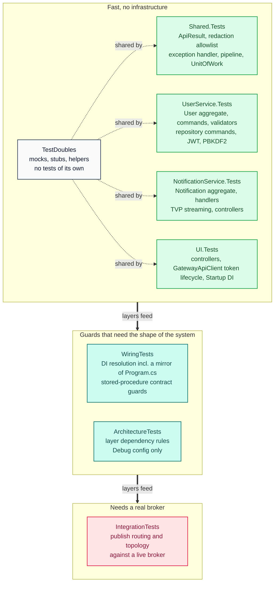

# Development

[Back to README](../README.md)

## Testing

Unit tests target the Application, Domain, Infrastructure, and Api layers, using **TUnit 1.69.0** (no NUnit, FluentAssertions, Moq, or NSubstitute in test code). Four test assemblies plus a shared TestDoubles project and two contract suites:

- **`UserService.Tests`** — commands, queries, validators, domain aggregates, infrastructure (repositories, PasswordHasher, JwtTokenService, consumer)
- **`NotificationService.Tests`** — commands, queries, validators, domain aggregates, infrastructure (repositories, TVP streaming), controllers
- **`Shared.Tests`** — ApiResult, ApiExceptionHandler, MessagingHealthCheck, pipeline behaviors (validation, logging, transaction), UnitOfWork, DomainEventCollector, `SqlCommands`, AppException hierarchy
- **`UI.Tests`** — controllers, `GatewayApiClient` token lifecycle (fast-path cache, 401 refresh, register-then-reauth, malformed JSON, idempotent 400), `Startup` DI wiring, `ErrorViewModel`
- **`TestDoubles`** — mocks, stubs and helpers shared by all four test assemblies (which never reference each other)
- **`WiringTests`** — DI resolution (including a mirror of each `Program.cs` API registration) **and** stored-procedure contract guards that scan production source text; the reason a pure refactor can break a test
- **`ArchitectureTests`** — ArchUnitNET dependency rules via the `TngTech.ArchUnitNET.TUnit` adapter. ArchUnitNET analyses IL, so a **Debug** build is required for it to see real instructions; the suite is currently also discovered and green under `-c Release`, but only Debug is a meaningful run.

## Test projects and what each one actually guards

The suite is layered deliberately: fast, isolated tests at the bottom, then guards that can only be
proved against real infrastructure at the top. Each project answers a different question, and a
green bottom does not imply a green top.



Three properties worth keeping in mind while reading a red run:

- **`TestDoubles` is a class library, not a suite.** It contributes no tests, which is why the
  solution-wide command always exits non-zero. Gate on `failed: 0`, never on the exit code.
- **`IntegrationTests` fails rather than skips when the broker is absent.** That is deliberate — a
  guard that skips unnoticed is indistinguishable from no guard — but it means a red run there is
  often an environment question rather than a code one.
- **A green layer does not imply a green layer above it.** `WiringTests` exists because pure unit
  tests could not see a DI registration that only breaks at runtime, and `ArchitectureTests`
  exists because nothing else asserts the dependency direction.

## Two guards worth knowing about

Both of these look like removable noise and are not.

- **A stored-procedure guard asserts on the migration _source_, not on SQL behaviour.**
  `StoredProcedureContractTests.Sp_NotificationHistoryInsert_IsIdempotent_For_A_RepeatPair` reads
  `DatabaseMigration.cs` and asserts the history insert is filtered with `WHERE NOT EXISTS` on both
  key columns. That stops someone deleting the guard. It does **not** prove the procedure behaves
  correctly when run — proving that needs a live database. The test says so in a comment, and so
  should any future one.
- **A DI guard that mirrors a `Program.cs` has to cover _both_ services.**
  `DependencyInjectionTests.Messaging_Disabled_ResolvesADispatcherAndRegistersNoBus` is
  parameterised over UserService and NotificationService, because the two `DependencyInjection`
  files contain the same `if/else` around `IDomainEventDispatcher` and only one of them was
  originally covered. Deleting NotificationService's `else` branch makes the `true` case fail and
  the `false` case pass — which is the whole diagnostic value of parameterising it.

## Broker-backed coverage

The generic-type-erasure defect fixed in `MassTransitDomainEventDispatcher` once shipped behind a fully
green suite. `Tests/IntegrationTests` now closes that gap: it publishes through the production
dispatcher to a **real RabbitMQ broker** and fails if the message does not reach a consumer bound to the
concrete event type.

No unit-level substitute is possible, and that is the point of the suite:

- A **mocked** `IPublishEndpoint` cannot observe exchange naming. The stub accepts anything, so it
  always "succeeds".
- The **in-memory transport** never reaches exchange-naming logic at all, so it cannot
  distinguish "the consumer received it" from "the message went somewhere unbound".

### Running it

```bash
docker compose -f docker-compose.test.yml up -d --wait rabbitmq
dotnet test Tests/IntegrationTests/IntegrationTests.csproj -c Debug
```

> The suite deliberately **fails rather than skips** when the broker is absent. A guard that skips
> unnoticed is how the original defect shipped behind a green suite.

#### When the TCP probe fails but the container is healthy

A refusal here has four causes, and the first is both the cheapest and the one most often skipped.
Check in this order.

**0. Is anything actually listening?** `docker ps` shows only *running* containers and `docker port`
prints a mapping whether or not `docker-proxy` bound anything, so both will confirm a
healthy-looking service that is not serving:

```bash
docker ps -a --filter name=test-rabbitmq     # Up, or Exited? (docker ps hides Exited)
ss -ltn | grep ':5673'                       # expect a 0.0.0.0:5673 listener
docker logs test-rabbitmq | grep -iE 'jose|crash'
```

If the mapping is printed but `ss` is empty, the fault is Docker's publishing (step 3). If the
container is `Exited`, read the logs before touching any network configuration.

**1. Is the host still running?** WSL terminates the VM after `vmIdleTimeout` (default 60 s) and the
distro after `instanceIdleTimeout` (default 15 s). Short-lived `wsl -d <distro> -- ...` commands will
repeatedly kill the container between invocations, and `restart: "no"` means it never returns:

```bash
uptime -s            # run across an idle gap: an advancing boot time is the answer
```

Fix in `C:\Users\<user>\.wslconfig`:

```ini
[wsl2]
vmIdleTimeout=86400000
[general]
instanceIdleTimeout=-1
```

**2. Did the broker crash?** `rabbitmq:3.13-management` can fail to boot, and the failure is
abbreviated rather than reported as unhealthy:

```
exception exit: {{shutdown,{failed_to_start_child,jose_server,terminating}},{jose_app,start,[normal,[]]}}
```

The image ships OpenSSL 3.1.8 with only the `default` provider and no `legacy`, which JOSE's
elliptic-curve key check needs. `docker-compose.test.yml` therefore sets
`RABBITMQ_SERVER_ADDITIONAL_ERL_ARGS=-rabbitmq_jose disable`; nothing in this repository exercises
OAuth2 token validation, so the plugin is not needed. Verify with:

```bash
docker logs test-rabbitmq 2>&1 | grep -ic 'jose_server'   # expect 0
docker inspect test-rabbitmq --format '{{.State.ExitCode}} {{.RestartCount}}'
```

**3. Never start `dockerd` by hand in a systemd-enabled distro.** A bare `nohup dockerd &` makes
systemd start a second instance that fights it for the socket, yielding a `(healthy)` container with
**nothing bound**:

```bash
systemctl is-active docker     # active
pgrep -c dockerd               # expect 1  - two instances is the fault
```

Recovery: `wsl --shutdown`, let systemd own it, wait for `active` with a single `dockerd`, then
recreate the container - `up` alone will not re-bind a stale one.

**4. Only then suspect the network.** Confirm NAT is actually applied (mirrored mode cannot forward
container ports, and `localhostForwarding` is *ignored* there):

```bash
hostname -I | tr ' ' '\n' | grep -E '^[0-9]+\.' | head -1   # NAT => 172.x, mirrored => LAN IP
```

The Hyper-V firewall (`Get-NetFirewallHyperVVMSetting -PolicyStore ActiveStore`) defaults
`DefaultInboundAction: Block` under NAT. Scoped allow rules for TCP 5673/15673 are permitted but were
**not sufficient** on the host this was reproduced on - do not record the issue as closed on the
strength of a rule existing:

```powershell
New-NetFirewallHyperVRule -Name 'WSL-NotificationSystem-RabbitMQ-AMQP' `
  -DisplayName 'WSL inbound: RabbitMQ 5673 (NotificationSystem IntegrationTests)' `
  -Enabled True -Direction Inbound -VMCreatorId '{40E0AC32-46A5-438A-A0B2-2B479E8F2E90}' `
  -Protocol TCP -LocalPorts 5673 -Action Allow
```

Undo with:

```powershell
Get-NetFirewallHyperVRule | Where-Object Name -Like 'WSL-NotificationSystem*' | Remove-NetFirewallHyperVRule
```

> ⚠️ **For an intermittent fault, one green run is not a fix.** Verify with a soak across at least
> the window in which it previously failed, and confirm `RestartCount=0`. The full account of this
> investigation - including three times a green observation was mistaken for a fix - is in
> [Green Instruments and Dead Services](learning/green-instruments-and-dead-services.md).

**When the host cannot be repaired,** run these tests inside the distro, where `127.0.0.1:5673`
reaches the broker directly: install the SDK with `dotnet-install.sh` and run
`dotnet test Tests/IntegrationTests/IntegrationTests.csproj`. Everything else in the suite runs on
Windows and is unaffected.


> **Credentials are read from the environment first, then the repository `.env`** - the same file
> `docker compose` used to build the container, so the two cannot disagree. Plain `dotnet test` does not
> load `.env` itself, and without this fallback the test process would silently fall back to `guest` while
> the container ran with a real account. RabbitMQ refuses `guest` off-loopback, so that mismatch surfaces
> as `Broker unreachable: guest@127.0.0.1:5673` - which reads like a transport fault but is an
> `ACCESS_REFUSED`. **Read the inner exception before blaming the broker.** No manual exporting is needed.

### What it asserts, and what it does not

The test publishes through a `DomainEvent`-typed variable, because erasure only happens that way - writing
`PublishAsync(new TestDomainEvent(...))` would let the compiler infer the concrete type and the test would
pass against the broken dispatcher.

Assertions are on **bound-queue topology**, never on `message_stats` counters: those are aggregated on an
interval and lag publication by 200-500 ms, and MassTransit's inheritance binding makes the base exchange
accumulate `publish_in` even when routing is correct. Counters cannot distinguish a real regression from
either effect.

Failure messages localise the stage via `IReceiveObserver` and `ISendObserver`. The send side is checked
**first**: if nothing was ever handed to the transport, a "nothing arrived" verdict would be a conclusion
about the wrong component.

### Verified by mutation

A green suite proves nothing on its own, so the guard was broken on purpose and confirmed red:

| Mutation                                                    | Result |
| ----------------------------------------------------------- | ------ |
| `Publish(domainEvent, ...)` - the `(object)` cast removed    | **red** - `STAGE -1 (SEND) FAILED`, nothing reached the transport |
| Cast restored (`git diff` clean)                            | green - 2/2 passed |

The mutation is run against the **production** dispatcher, not a test double, so a passing test
proves the dispatcher still routes on the runtime type.
## Verifying a test actually guards something

A test that asserts on a string can pass for the wrong reason, so the three guards added for the
idempotency and messaging work were each broken on purpose and confirmed red:

| Guard                      | What was broken                                              | Result                                                                                     |
| -------------------------- | ------------------------------------------------------------ | ------------------------------------------------------------------------------------------ |
| History-insert idempotency | the asserted literal in the test                             | `Sp_NotificationHistoryInsert_IsIdempotent_For_A_RepeatPair` red                           |
| Messaging-disabled DI      | deleted NotificationService's `else` branch (**production**) | `Messaging_Disabled_ResolvesADispatcherAndRegistersNoBus(True)` red, `(False)` still green |
| Affected-row trim          | reverted the clamp to `toSend` (**production**)              | `Handle_WhenConcurrentRequestWinsTheDraftRace_...` red                                     |

The second and third are the ones that matter: they were proved by breaking the
implementation, not the assertion. A mutation that edits the test only proves the test can read
its own string.

## TUnit rules this codebase has tripped over

- **A void `IRequest` is verified with a matcher typed to the concrete command, not to `IRequest`.**
  MediatR routes a void request through the non-generic `Send(IRequest, CancellationToken)`, so
  `Arg.Is<IRequest>(...)` compiles and then matches nothing (`called 0 time(s)`).
- **`Times.Once` is a property, not `Times.Once()`.** `VerifyLog()` / `VerifyNoLog()` are extension
  methods in `TUnit.Mocks.Logging`, so the `using` is required.
- **`DomainEventCollector` is static ambient state** — clear it in `[After]` where a test touches it.
  TUnit gives a fresh class instance per test but does not reset statics, and tests run in parallel.
- **Never assert against the constant a value was built from.** `Assert.That(sql).Contains(SomeColumnsConstant)`
  is circular — mutating the constant leaves the test green.
- **`--no-incremental` is a `dotnet build` flag.** Passing it to `dotnet test` gives `total: 0, error: 7`
  and no message. Use `dotnet build --no-incremental` then `dotnet test --no-build`.
- **A test that reads process-wide mutable state needs `[NotInParallel]`.** TUnit runs tests in
  parallel by default. If a test reflects into a static (or reads a static cache) that other tests in
  the same assembly mutate, it is racing them — `[NotInParallel]` with no keys makes it run alone.
- **`Assert.That(object)` is type-strict.** A reflection or boxed value compared against a differently-typed
  expectation fails even when the numbers match. Compare numerically when the value came out of
  reflection.
- **After any mutate/restore cycle, re-read the file to confirm the restore, then rebuild before
  trusting a suite result.** A test run started right after a restore can race it and report the
  mutants as genuine failures.

> ✅ **One test used to be intermittent here, and the cause is worth knowing.**
> `Dapper_DateTime_Maps_To_DateTime2_And_Configure_Is_Idempotent` read Dapper's private static
> `typeMap` by reflection while every other test in its class called `DapperConfiguration.Configure()`,
> mutating that same dictionary — a reader racing its own writers. It failed **1 run in 5** at the
> solution level and **0 in 7** when the project was run alone. Two things were wrong, and both
> mattered: the read was unsynchronised, _and_ the assertion compared a boxed value type-strictly,
> so `expected DateTime2 but received -2` was a **type-identity** message, not a wrong number
> (`DbType.DateTime2` **is** `-2`). The test is now `[NotInParallel]` and compares the numeric value.
>
> The generalisable lesson: if an assertion message says `expected X but received <X's own value>`,
> suspect the runtime _type_ of the comparison before you go hunting for a value bug.

## The DI guard, and why it eagerly resolves

`DependencyInjectionTests.*_ApiRegistrations_AllResolve` mirrors the registration block of each
service's `Program.cs` and **actively resolves** `IExceptionHandler`. It exists because of a real
defect: `ApiExceptionHandler` constructor once took a bare `string` instead of
`IHostEnvironment`, which compiled cleanly, started cleanly, and threw the first time an unhandled
exception needed translating — i.e. exactly when the `ApiResult` envelope had to be produced.

Two non-obvious things about it, both of which will look like removable noise:

- **`ValidateOnBuild` is deliberately OFF for the API scope.** It is not enough _and_ it is
  actively misleading here. `AddExceptionHandler<T>` registers a lazily-constructed singleton, so
  graph validation inspects the descriptor and never calls the constructor — the defect stays
  invisible. Meanwhile validation _false-positives_ on MVC's own descriptors
  (`ControllerActionInvokerProvider`, `ControllerRequestDelegateFactory`, …), which depend on
  services `WebApplicationBuilder` supplies but a bare `ServiceCollection` does not. Removing the
  eager resolve re-opens the blind spot; enabling `ValidateOnBuild` buries the real signal in
  framework noise. `ValidateScopes` stays on.
- **`IWebHostEnvironment` and `IHostEnvironment` are registered explicitly**, pointing at one local
  stub, because MVC's registrations consume `IWebHostEnvironment`. `MessagingHealthCheck` is
  asserted through `IOptions<HealthCheckServiceOptions>`, not by resolving the type — `AddCheck<T>(name)`
  registers an _instance_, so the type is not resolvable as a service at all.

Run all tests:

```bash
dotnet test NotificationSystem.slnx -c Release
```

> ⚠️ **The solution-wide command exits `8`, not `0`.** `TestDoubles` is a class library with no tests, and `global.json`'s `test` node supports only `runner`, so a project cannot be excluded. **Check `failed: 0` rather than the exit code.** Running an individual test project does exit 0, if a script needs a hard gate.
>
> **Do not try to "fix" this.** Three exclusion attempts were made and all three were reverted: a `testconfig.json` filter, a solution filter, and reclassifying `TestDoubles` as a non-test library. `global.json` cannot exclude a project, so the exit code is Microsoft.Testing.Platform's project-selection behaviour, not a defect in this repository. If a CI gate keys on the exit code it will be permanently red, with a three-second "Zero tests ran" line as the only clue.

Test conventions worth knowing before writing a test:

- Assertions must be **awaited** — `await Assert.That(…)`. This is a compile error, so a `void` test method cannot contain one; use the static `Assert.Throws<T>(…)` there.
- **Verify every mock you inject** (`WasCalled(Times.Once)`). Stubbing alone does not prove the dependency was used.
- **Mutation-verify new or rewritten tests** — break the production code, confirm the test fails, then revert. This repo shipped 106 tests with empty bodies that all passed, and a single mutation later exposed a live production defect that three green tests had missed.
- **Repository tests assert the `CommandDefinition`s**, not the connection: Dapper's query methods are static extensions on `IDbConnection` and cannot be intercepted. Row mapping needs a live provider and is deliberately out of scope.
- **TUnit specifics that will otherwise cost a cycle:** `Times.Once` is a property, not a method; `VerifyLog()` / `VerifyNoLog()` are extension methods in `TUnit.Mocks.Logging` (the `using` is required even though `Mock.Logger<T>()` resolves); and `dotnet test --filter` reports `Zero tests ran` under Microsoft.Testing.Platform — run the project and read the summary instead.
- **Watch for vacuous assertions when testing serialization.** `DefaultHttpContext.Response.Body` is `Stream.Null`, so anything written to it is discarded and every `DoesNotContain` against the body passes for free. Likewise an exception that is only `new`-ed has a null `StackTrace`. Both shapes produced green tests that asserted nothing before an explicit non-vacuity check was added.

Collect coverage. TUnit runs on **Microsoft.Testing.Platform**, not VSTest, so there is no
`dotnet-coverage`/`.runsettings` step — `--coverage` is a first-class flag on the test host:

```bash
# Per test project (run each; coverage is per-assembly-set, not solution-wide)
cd Tests/UnitTests/Shared.Tests
dotnet run -c Release --coverage

# Other formats / explicit output directory
dotnet run -c Release --coverage --coverage-output-format cobertura --coverage-output-format xml
```

Results land in `bin/Release/net10.0/TestResults/` (an HTML report and a `.tunit-report.json` are
written alongside the Cobertura file). `--coverage-output` is resolved relative to the test output
directory, not the project directory, so pass an absolute path if you want it elsewhere.

> **Measured line coverage (Shared.Tests, Release):** `Shared.Domain` 92.5%, `Shared.Application`
> 90.3%, `Shared.Api` 89.0%, `Shared.Infrastructure` 65.5%. These are the real numbers as of this
> commit — an earlier "99–100%" claim in this file was not reproducible by any workflow the README
> described, and has been replaced rather than restated. Re-measure before quoting a figure.

## Adding New Features

1. Define the entity in the service's `Domain/Entities/` folder — add a `Rehydrate(...)` factory if its identity is DB-assigned
2. Create repository interface in `Domain/Abstractions/`
3. Implement concrete repository in `Infrastructure/Repositories/` — **execution only**
4. Add a `*CommandFactory` in `Infrastructure/Persistence/` holding that repository's `CommandDefinition` builders, reusing `SqlCommands` for the shared shapes
5. Create DTO in `Application/DTOs/`
6. Create command/query in `Application/Commands/` or `Application/Queries/`
7. Create handler in same directory - implement `IRequestHandler<TCommand, TResponse>`, or `IRequestHandler<TCommand>` for a void command with no meaningful result
8. Create FluentValidation validator in same directory — include a case **at** each limit, not only over it
9. Add controller in `Api/Controllers/`, delegate to `IMediator`
10. Register services in `Api/Program.cs`
11. Add routing in `Services/ApiGateway/ocelot.json` **under the `Routes` array** (single source; `ocelot.Development.json` overrides for local dev). Do not use the legacy `ReRoutes` key — Ocelot 25.x ignores it and every gateway call returns 404
12. Create UI pages if needed
13. Add unit tests in `Tests/UnitTests/<Assembly>/...` (mocks/stubs/helpers in `TestDoubles/`), and mutation-verify them
